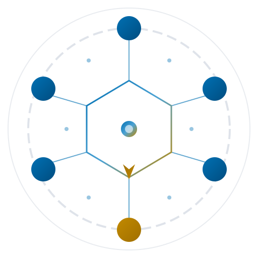

<div align="center">
  
  <h1>DIAL</h1>
  <p><strong>Dynamic Integration between AI and Labor</strong></p>
  <p>A coordination framework for AI and human specialists making<br>decisions together within state machines.</p>
  <br>
  <a href="https://eloquentanalytics.github.io/dialai/"><strong>Documentation</strong></a> · <a href="https://eloquentanalytics.github.io/dialai/docs/getting-started/installation"><strong>Get Started</strong></a> · <a href="https://github.com/eloquentanalytics/dialai/issues"><strong>Issues</strong></a>
  <br><br>
</div>

## Overview

DialAI provides a framework for answering a fundamental question: *Given any task modeled as a state machine, how do you know — in dollars, time, and quality — exactly what it would cost to turn that task over to a minimally competent AI decision-maker?*

DialAI starts from a deliberately pessimistic assumption: **AI has no role.** LLM specialists begin with weight 0.0. The default assumption is that the task is too difficult for AI and only humans can navigate it. DialAI then provides the mechanism to prove otherwise, one decision at a time.

## Key Principles

- **Human Primacy**: The human is always right — not because humans are infallible, but because humans have context that AI cannot access.
- **Progressive Collapse**: Over repeated decision cycles, measuring how well AI predicts human choices causes the multi-agent deliberation structure to progressively collapse into deterministic execution.
- **Empirical Trust**: Trust is earned through demonstrated alignment with human decisions, not assumed.

## Quick Start

```bash
npm install dialai
```

```typescript
import { createSession, registerSpecialist } from "dialai";

// Create a session with a state machine
const session = createSession({
  machineName: "my-task",
  initialState: "idle"
});

// Register an AI specialist
await registerSpecialist({
  specialistId: "specialist.my-task.proposer.gpt-4",
  machineName: "my-task",
  specialistRole: "proposer",
  modelId: "gpt-4"
});
```

## Documentation

Full documentation is available at [https://eloquentanalytics.github.io/dialai/](https://eloquentanalytics.github.io/dialai/).

## Development

```bash
# Install dependencies
npm install

# Run tests
npm test

# Build
npm run build

# Type check
npm run typecheck

# Lint
npm run lint
```

## License

DialAI is licensed under the Business Source License 1.1 (BUSL-1.1). This license allows free use for development, testing, evaluation, and internal use, but restricts commercial use, particularly by cloud providers offering DialAI as a hosted or managed service.

**Key restrictions:**
- You may not use DialAI to provide a service to third parties
- You may not offer DialAI as a hosted or managed service
- You may not use DialAI in a production environment to provide services to third parties

**Permitted uses:**
- Development, testing, and evaluation
- Internal use within your organization
- Contributing to the project

**Change Date:** January 1, 2029  
**Change License:** Apache License 2.0

On the Change Date, DialAI will automatically convert to the Apache License 2.0, making it fully open source. This approach protects the project from cloud provider exploitation while ensuring eventual open source availability.

See [LICENSE](LICENSE) for full terms.
