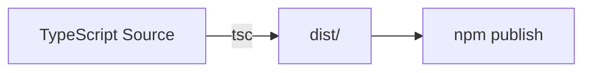
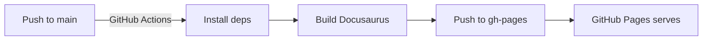
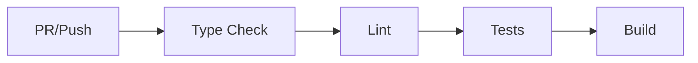

# DialAI Architecture

This document describes the repository structure, build pipeline, and architectural decisions for the DialAI project.

## Repository Structure

```
dialai/
├── .github/
│   ├── workflows/              # GitHub Actions CI/CD workflows
│   │   ├── ci.yml              # Continuous integration (test, lint, build)
│   │   ├── deploy-website.yml  # Build and deploy website to GitHub Pages
│   │   └── publish-npm.yml     # Publish npm package on release
│   ├── ISSUE_TEMPLATE/         # GitHub issue templates
│   └── PULL_REQUEST_TEMPLATE.md
│
├── dev/                        # Internal development documentation
│   ├── ARCHITECTURE.md         # This file
│   ├── DIAL_CONCEPTS.md        # Core concepts and terminology
│   ├── DIAL_CONSTITUTION.md    # Specialist behavior guidelines
│   ├── DIAL_FRAMEWORK.md       # Technical framework specification
│   ├── DIAL_MANIFESTO.md       # Project philosophy and principles
│   └── DIAL_THEORY.md          # Theoretical foundation
│
├── examples/                   # Standalone example implementations
│   └── (examples to be added)
│
├── src/
│   └── dialai/                 # Core framework implementation
│       ├── core/               # State machine, session management
│       ├── specialists/        # Proposer, voter, tool interfaces
│       ├── strategies/         # Pluggable strategy implementations
│       ├── arbitration/        # Consensus evaluation logic
│       ├── types/              # TypeScript type definitions
│       ├── utils/              # Utility functions
│       └── index.ts            # Package entry point
│
├── tests/                      # Integration and E2E tests
│   ├── integration/            # Full decision cycle tests
│   └── fixtures/               # Shared test doubles and mocks
│
├── website/                    # Docusaurus documentation site (source)
│   ├── docs/                   # Documentation markdown files
│   │   ├── intro.md
│   │   ├── getting-started/
│   │   ├── concepts/           # Sessions, specialists, decision cycle
│   │   ├── guides/             # Implementation tutorials
│   │   ├── api/                # API reference (TypeDoc generated)
│   │   └── examples/
│   ├── src/
│   │   ├── pages/              # Marketing pages (React)
│   │   │   └── index.tsx       # Landing page
│   │   ├── components/         # Reusable React components
│   │   └── css/                # Custom styles
│   ├── static/                 # Static assets (images, logos)
│   ├── docusaurus.config.ts    # Docusaurus configuration
│   └── sidebars.ts             # Documentation navigation
│
├── .eslintrc.cjs               # ESLint configuration
├── .gitignore                  # Git ignore patterns
├── .prettierrc                 # Prettier configuration
├── LICENSE                     # Business Source License 1.1
├── package.json                # Root package.json (npm package config)
├── README.md                   # Project overview
├── tsconfig.json               # TypeScript config (development)
├── tsconfig.build.json         # TypeScript config (production build)
└── vitest.config.ts            # Vitest test configuration
```

## Directory Purposes

### `/src/dialai/` - Framework Implementation

The core TypeScript framework code that will be published to npm as the `dialai` package.

- **Entry Point**: `index.ts` exports the public API
- **Build Output**: Compiled to `dist/` directory (gitignored)
- **Publishing**: Only `dist/` is published to npm (via `package.json` `files` field)

### `/website/` - Documentation Site

Docusaurus-powered documentation and marketing site deployed to GitHub Pages.

- **Source**: All Docusaurus source files live here
- **Build Output**: Generated to `website/build/` (gitignored)
- **Deployment**: Built site is pushed to `gh-pages` branch via GitHub Actions
- **URL**: https://eloquentanalytics.github.io/dialai/

**Why `/website` instead of `/docs`?**

GitHub Pages' "publish from `/docs` folder" feature expects pre-built static HTML. Docusaurus source needs to be built first, so we use the modern approach:
- Source in `/website`
- GitHub Actions builds and deploys to `gh-pages` branch
- GitHub Pages serves from `gh-pages` branch

This avoids committing build artifacts to main and follows the pattern used by Docusaurus, XState, and other major TypeScript projects.

### `/dev/` - Internal Documentation

Development documentation that informs the project but isn't published directly to users.

- **Purpose**: Dense theoretical and specification documents for maintainers
- **Relationship**: Content is adapted into user-friendly docs in `/website/docs/`
- **Audience**: Project contributors and maintainers

### `/tests/` - Integration Tests

Integration and end-to-end tests that span multiple modules.

- **Unit Tests**: Colocated with source (`src/**/*.test.ts`)
- **Integration Tests**: In `/tests/integration/`
- **Fixtures**: Shared mocks and test data in `/tests/fixtures/`

### `/examples/` - Example Projects

Standalone example implementations demonstrating framework usage.

- **Purpose**: Reference implementations for common use cases
- **Structure**: Each example is a self-contained project
- **Dependencies**: Examples reference the published `dialai` npm package

## Build Pipeline

### Framework Build (`npm run build`)



1. TypeScript source in `src/dialai/` is compiled using `tsconfig.build.json`
2. Output written to `dist/` directory
3. Only `dist/` is published to npm (via `package.json` `files` field)
4. Source maps and declaration files included for debugging and type support

### Website Build & Deployment



1. **Trigger**: Push to `main` branch affecting `/website/**` or workflow file
2. **Build**: GitHub Actions runs `npm install` and `npm run build` in `/website`
3. **Deploy**: Built static files pushed to `gh-pages` branch
4. **Serve**: GitHub Pages automatically serves from `gh-pages` branch

**Workflow**: `.github/workflows/deploy-website.yml`

### CI Pipeline



**Workflow**: `.github/workflows/ci.yml`

Runs on every PR and push to `main`:
- Type checking (`tsc --noEmit`)
- Linting (ESLint)
- Testing (Vitest)
- Build verification

## Testing Strategy

### Hybrid Approach

**Unit Tests** - Colocated with source:
- Location: `src/dialai/**/*.test.ts`
- Purpose: Test individual functions/classes in isolation
- Example: `src/dialai/core/session.test.ts` tests `session.ts`

**Integration Tests** - Separate directory:
- Location: `tests/integration/`
- Purpose: Test multiple modules working together
- Example: Full decision cycle (propose → vote → arbitrate → execute)

**Fixtures** - Shared test utilities:
- Location: `tests/fixtures/`
- Purpose: Reusable mocks, test data, state machine definitions

### Why Colocated Unit Tests?

- Easy to discover tests for a given module
- Encourages writing tests alongside code
- Common pattern in modern TypeScript projects (Zod, tRPC)
- Excluded from npm via `package.json` `files` field

## Documentation Architecture

### Two-Layer Documentation System

**Layer 1: Internal (`/dev/`)**
- Dense, technical specifications
- Theoretical foundations
- Framework implementation details
- Audience: Maintainers and contributors

**Layer 2: Public (`/website/docs/`)**
- User-friendly guides and tutorials
- Concepts explained for end users
- API reference (auto-generated from TypeScript)
- Audience: Framework users

### Documentation Generation

**Manual Content**:
- Concepts, guides, examples written in Markdown/MDX
- Located in `website/docs/`

**Auto-Generated Content**:
- API reference generated from TypeScript source via TypeDoc
- (To be configured: TypeDoc plugin for Docusaurus)

**Marketing Content**:
- Landing page and feature pages in `website/src/pages/`
- React components for interactive demos

## Key Architectural Decisions

### 1. Single Package (Not Monorepo)

**Decision**: Start with a single `dialai` npm package.

**Rationale**:
- Simpler initial setup and maintenance
- Can split into monorepo later if needed
- Most TypeScript libraries start this way

**Future**: If the project grows, we can migrate to a monorepo structure (e.g., `packages/core`, `packages/cli`).

### 2. `/website` + GitHub Actions Deployment

**Decision**: Use `/website` for Docusaurus source, deploy via GitHub Actions to `gh-pages`.

**Rationale**:
- Avoids committing build artifacts to main branch
- Follows modern best practices (Docusaurus, XState, tRPC)
- Cleaner git history
- Automatic deployment on push

**Alternative Considered**: `/docs` folder with pre-built files (rejected - requires manual build steps).

### 3. Business Source License (BUSL-1.1)

**Decision**: Use Business Source License 1.1 instead of MIT/Apache.

**Rationale**:
- Protects against cloud provider exploitation
- Allows free use for development, testing, internal use
- Converts to Apache 2.0 on January 1, 2029
- Common pattern for open source projects that want commercial protection

### 4. TypeScript-First

**Decision**: Pure TypeScript implementation with strict type checking.

**Rationale**:
- Type safety catches errors at compile time
- Better IDE support and autocomplete
- Self-documenting code through types
- Enables API documentation generation via TypeDoc

### 5. Vitest for Testing

**Decision**: Use Vitest instead of Jest.

**Rationale**:
- Faster execution (native ESM support)
- Better TypeScript integration
- Modern tooling (Vite-based)
- Growing ecosystem

### 6. Colocated Unit Tests

**Decision**: Place unit tests next to source files (`*.test.ts`).

**Rationale**:
- Easy to find tests for a given module
- Encourages test writing
- Common in modern TypeScript projects
- Excluded from npm publish via `files` field

## Development Workflow

### Local Development

```bash
# Install dependencies
npm install
cd website && npm install

# Run tests
npm test

# Type check
npm run typecheck

# Lint
npm run lint

# Build framework
npm run build

# Develop website locally
cd website && npm start
```

### Making Changes

1. **Framework Code**: Edit files in `src/dialai/`
2. **Tests**: Add/update tests in same directory or `tests/`
3. **Documentation**: Edit files in `website/docs/` or `website/src/pages/`
4. **Commit & Push**: Changes trigger CI and website deployment

### Publishing

**npm Package**:
- Create a GitHub release
- Triggers `.github/workflows/publish-npm.yml`
- Builds and publishes to npm registry

**Website**:
- Automatic on push to `main`
- No manual steps required

## File Organization Principles

1. **Separation of Concerns**: Framework code, tests, docs, and website are clearly separated
2. **Build Artifacts Gitignored**: `dist/`, `build/`, `node_modules/` never committed
3. **Source of Truth**: TypeScript source is authoritative; generated files are derived
4. **Documentation as Code**: Docs live in the repo, versioned with code
5. **Testability**: Structure supports both unit and integration testing

## Future Considerations

### Potential Expansions

- **Monorepo Migration**: If splitting into multiple packages becomes necessary
- **CLI Tool**: Separate `dialai-cli` package for command-line usage
- **Server Implementation**: Backend server package for session management
- **TypeDoc Integration**: Auto-generate API docs from TypeScript source
- **Example Gallery**: Expand `/examples/` with more comprehensive demos

### Scalability

The current structure supports:
- Growing the framework API without restructuring
- Adding more documentation sections easily
- Expanding test coverage incrementally
- Adding example projects independently

## References

- [DIAL_FRAMEWORK.md](./DIAL_FRAMEWORK.md) - Technical framework specification
- [DIAL_CONCEPTS.md](./DIAL_CONCEPTS.md) - Core concepts and terminology
- [DIAL_THEORY.md](./DIAL_THEORY.md) - Theoretical foundation
- [DIAL_MANIFESTO.md](./DIAL_MANIFESTO.md) - Project philosophy
- [DIAL_CONSTITUTION.md](./DIAL_CONSTITUTION.md) - Specialist behavior guidelines
