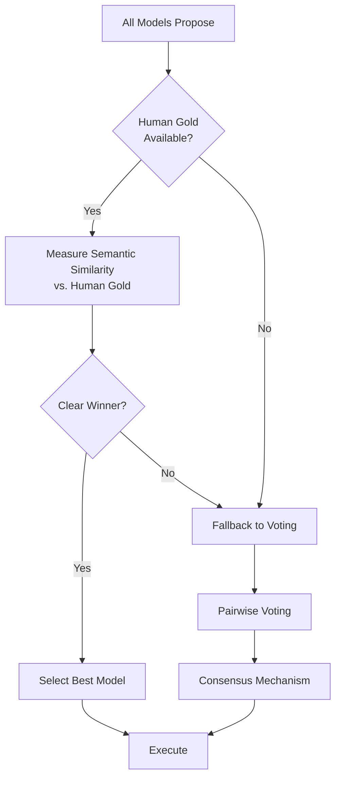

# Alignment Measurement vs. Voting

When building LangChain graphs with multiple models, you face a fundamental question: **Do you need voting, or can you rely solely on direct alignment measurement with human gold examples?**

This document addresses when voting is necessary versus when direct alignment measurement (e.g., semantic similarity of reasoning) is sufficient.

## Two Approaches

### Approach 1: Direct Alignment Measurement

**Workflow:**
1. Multiple models propose next steps
2. Compare each proposal's reasoning against human gold examples using semantic similarity
3. Select the model with highest alignment score
4. Use that model going forward (with some % allocated to humans for quality control)

**When this works:**
- You always have human gold examples available
- Semantic similarity provides clear, unambiguous alignment scores
- You're making state-by-state decisions where alignment can be measured immediately
- The goal is progressive delegation: find the best-aligned model, then use it

**Advantages:**
- Direct measurement: no intermediate voting step
- Faster decisions: no need to wait for pairwise comparisons
- Clearer signal: alignment score directly reflects how well a model matches human reasoning
- Mathematically simpler: one comparison per model, not O(N²) pairwise votes

### Approach 2: Voting-Based Consensus

**Workflow:**
1. Multiple models propose next steps
2. Voters (models or humans) compare proposals pairwise
3. Consensus mechanism (e.g., ahead-by-k) determines winner
4. Alignment is measured retrospectively to update model weights

**When this works:**
- Human gold examples aren't always available
- You need a mechanism to compare proposals when alignment scores are ambiguous
- Multiple stakeholders need to participate in the decision
- You want to measure alignment over time through voting behavior

**Advantages:**
- Works without human gold examples (models vote on each other)
- Handles ambiguous cases where semantic similarity is unclear
- Provides rich data for alignment measurement (voting patterns)
- Supports multi-stakeholder scenarios

## Do You Need Voting?

### You Probably Don't Need Voting If:

1. **You always have human gold examples** for each decision point
2. **Semantic similarity provides clear alignment scores** that distinguish between models
3. **Your goal is model selection**, not consensus-building
4. **You're doing state-by-state alignment** where you can measure and select immediately

In this case, your workflow is:
```
Propose (all models) → Measure Alignment (vs. human gold) → Select Best Model → Execute
```

Voting adds unnecessary complexity. You're not trying to build consensus; you're trying to find the model that best matches human reasoning.

### You Probably Do Need Voting If:

1. **Human gold examples aren't always available** (you need a fallback mechanism)
2. **Alignment scores are often ambiguous** (multiple models score similarly)
3. **You want to measure alignment over time** through voting patterns
4. **Multiple stakeholders** (humans and models) need to participate in decisions
5. **You're building consensus**, not just selecting the best model

In this case, voting serves multiple purposes:
- **Decision mechanism**: When human gold isn't available
- **Tie-breaking**: When alignment scores are too close
- **Alignment measurement**: Voting patterns provide data for weight recalibration
- **Multi-stakeholder coordination**: Humans and models participate together

## Hybrid Approach: Alignment-First with Voting Fallback

The most practical approach combines both:

### Primary Path: Direct Alignment Measurement



### When to Use Each Path

**Use Direct Alignment:**
- Human gold example exists
- Semantic similarity score difference > threshold (e.g., > 0.1)
- Single decision point (not building consensus across stakeholders)

**Use Voting:**
- No human gold example available
- Alignment scores are too close (difference < threshold)
- Multiple stakeholders need to participate
- You want to collect voting data for alignment measurement

## Semantic Similarity as Additional Weighting

You mentioned incorporating semantic similarity of reasoning as additional weighting. This can enhance both approaches:

### In Direct Alignment Measurement

Semantic similarity becomes the primary metric:
```
alignment_score = semantic_similarity(model_reasoning, human_gold_reasoning)
```

### In Voting

Semantic similarity can weight votes:
```
vote_weight = base_weight × semantic_similarity(voter_reasoning, human_gold_reasoning)
```

This allows models with reasoning closer to human gold to have more influence in the voting process.

## State-by-State Decision Making

Your workflow involves making alignment decisions **state by state**. This is compatible with both approaches:

### With Direct Alignment

1. At each state, measure alignment of all model proposals vs. human gold
2. Select the best-aligned model for this state
3. Track which model performs best at which state
4. Progressive delegation: as alignment improves, reduce human involvement

### With Voting

1. At each state, models propose and vote
2. Measure alignment retrospectively (which model's votes matched human votes)
3. Update model weights based on alignment
4. Progressive delegation: higher-weight models get more influence

## Progressive Collapse

Both approaches support progressive collapse (the system simplifying as alignment improves):

**Direct Alignment:**
- As models improve, alignment scores increase
- Eventually, one model consistently wins → use only that model
- Human involvement reduces as alignment approaches 1.0

**Voting:**
- As models improve, their weights increase
- Eventually, high-weight models dominate → fewer votes needed
- System collapses to deterministic execution

## Recommendation

For your specific use case (comparing multiple models, measuring alignment with human gold, state-by-state decisions, progressive delegation):

**You probably don't need traditional voting** if:
- You always have human gold examples
- Semantic similarity provides clear alignment signals
- Your goal is model selection, not consensus-building

**However, voting is still valuable as:**
- A fallback when human gold isn't available
- A tie-breaking mechanism when alignment scores are ambiguous
- A data collection mechanism for measuring alignment over time

**Best approach:** Implement alignment-first selection with voting as a fallback. This gives you:
1. Fast, direct decisions when human gold is available
2. Robust fallback when it's not
3. Rich data for alignment measurement
4. Support for multi-stakeholder scenarios

## Implementation Notes

### Alignment Measurement

```typescript
interface AlignmentScore {
  modelId: string;
  proposalId: string;
  semanticSimilarity: number; // 0.0 - 1.0
  reasoning: string;
  humanGoldReasoning: string;
}

function measureAlignment(
  modelProposals: Proposal[],
  humanGold: HumanGoldExample
): AlignmentScore[] {
  return modelProposals.map(proposal => ({
    modelId: proposal.specialistId,
    proposalId: proposal.proposalId,
    semanticSimilarity: computeSimilarity(
      proposal.reasoning,
      humanGold.reasoning
    ),
    reasoning: proposal.reasoning,
    humanGoldReasoning: humanGold.reasoning
  }));
}
```

### Selection Logic

```typescript
function selectBestModel(
  alignmentScores: AlignmentScore[],
  threshold: number = 0.1
): string | "needs_voting" {
  const sorted = alignmentScores.sort((a, b) => 
    b.semanticSimilarity - a.semanticSimilarity
  );
  
  if (sorted.length < 2) {
    return sorted[0]?.modelId || "needs_voting";
  }
  
  const difference = sorted[0].semanticSimilarity - sorted[1].semanticSimilarity;
  
  if (difference >= threshold) {
    return sorted[0].modelId; // Clear winner
  }
  
  return "needs_voting"; // Too close, use voting
}
```

## Related Concepts

- [Arbitration](./arbitration.md): How consensus is evaluated (if using voting)
- [Consensus Strategies](./consensus-strategies.md): Built-in strategies for arbiters
- [Human Primacy](./human-primacy.md): Why human gold examples are the ground truth
- [Specialists](./specialists.md): How models participate as proposers and voters
- [Decision Cycle](./decision-cycle.md): The PVAE cycle (includes voting phase)
