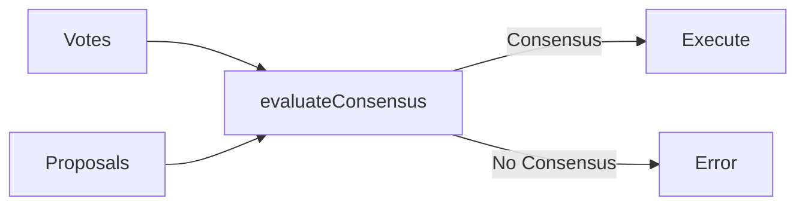

# Arbitration

**Arbitration** is the process of evaluating consensus and determining when a proposal has sufficient support to execute.

## Overview

After specialists submit proposals and cast votes, the `evaluateConsensus` function analyzes the results:



## The Built-in Arbiter: Ahead-by-K

DIAL ships with a built-in arbitration strategy that implements **voting with human override**.

### Rules

1. **Zero proposals**: No consensus (`consensusReached: false`)

2. **Single proposal**: Auto-consensus (the lone proposal wins)

3. **Two or more proposals**: Evaluate votes:
   - If any human has voted, their choice wins immediately
   - Otherwise, tally votes per proposal
   - The leading proposal must be ahead by `k = 1` votes

### Vote Tallying

For each vote comparing proposals A and B:

| Vote | Effect |
|------|--------|
| `"A"` | Adds 1 to proposal A's tally |
| `"B"` | Adds 1 to proposal B's tally |
| `"BOTH"` | Adds 1 to both proposals' tallies |
| `"NEITHER"` | Adds nothing to either proposal |

If all voters vote NEITHER, no proposal reaches the threshold and consensus fails.

### Example

```
Proposal A: "approve"
  - Voter 1 votes A
  - Voter 2 votes A
  Total for A: 2

Proposal B: "request_changes"
  - Voter 3 votes B
  Total for B: 1

Ahead by: 2 - 1 = 1

k = 1: Consensus reached (1 >= 1)
```

### Human Override

When a human votes, the calculation short-circuits:

```
Proposal A: "approve"
  - AI Voter 1 votes A
  - AI Voter 2 votes A

Proposal B: "request_changes"
  - Human Voter votes B

Result: B wins immediately

Human primacy: AI votes don't matter when a human participates.
```

A specialist is considered "human" if their `specialistId` contains "human" (case-insensitive).

## Using evaluateConsensus

```typescript
import { evaluateConsensus } from "dialai";

const result = evaluateConsensus("session-123");

// Result shape:
// {
//   consensusReached: boolean,
//   winningProposalId?: string,
//   reasoning: string
// }
```

The `ConsensusResult` type:

```typescript
interface ConsensusResult {
  consensusReached: boolean;
  winningProposalId?: string;
  reasoning: string;
}
```

## The Engine's Behavior

When using `runSession`, the engine handles arbitration automatically:

1. **Single proposal**: auto-wins (e.g., only the built-in proposer is registered)
2. **2+ proposals**: the engine uses Swiss tournament pairing, matching proposals with similar accumulated support first. It round-robins through registered voters, checking for consensus after each vote. Voting stops as soon as the ahead-by-k threshold is met. The O(N²) full comparison is the worst case, not the typical case.
3. **No consensus**: if no proposal crosses the threshold after all available pairs and voters are exhausted, the engine throws an error

## Best Practices

### 1. Start with Simple Machines

Begin with machines where the built-in deterministic proposer can navigate to the goal. Add additional proposers and voters as complexity grows.

### 2. Use Descriptive Reasoning

Always include clear reasoning in proposals and votes:

```typescript
// Good
{ voteFor: "A", reasoning: "Proposal A moves to done state, which is the goal" }

// Bad
{ voteFor: "A", reasoning: "A" }
```

### 3. Monitor NEITHER Votes

High NEITHER rates indicate:
- Poor proposal quality
- Unclear decision prompts
- Specialists that don't understand the task

## Related Concepts

- [Decision Cycle](./decision-cycle.md): Where arbitration fits
- [Specialists](./specialists.md): Voting
- [Human Primacy](./human-primacy.md): Why humans override
