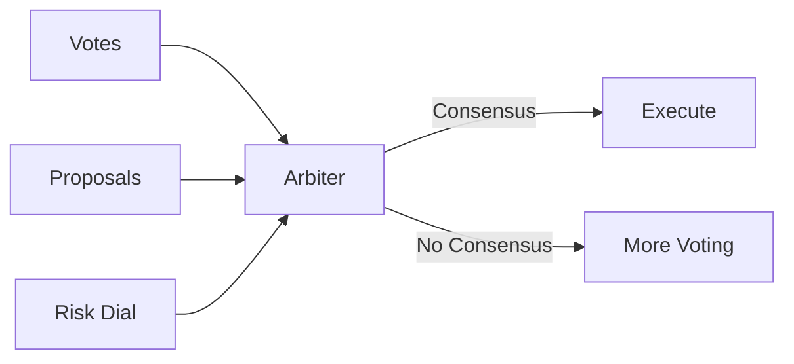
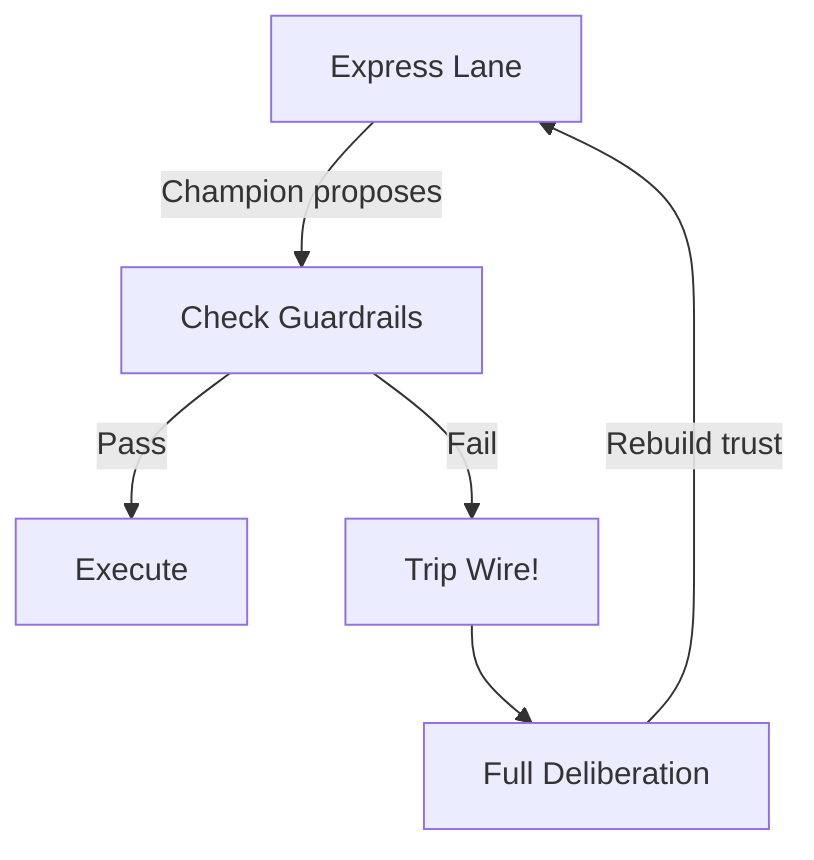

# Arbitration

**Arbitration** is the process of evaluating consensus and determining when a proposal has sufficient support to execute.

## Overview

After specialists submit proposals and cast votes, an **Arbiter** analyzes the results:



Arbiters are pluggable strategies—you can implement custom consensus logic while DIAL handles the coordination.

## The Default Arbiter: Weighted Ahead-by-K

DIAL ships with a default arbitration strategy that implements **weighted voting with human override**.

### Rules

1. **Human votes win immediately**
   - If any human has voted, their choice wins
   - No further calculation needed

2. **AI votes are weighted**
   - Each AI specialist has a weight (0.0 - 1.0+)
   - Weights are earned through alignment with human choices

3. **Ahead-by-K threshold**
   - The leading proposal must be ahead by `k` weighted votes
   - Default `k = 1.0` (must have a full point lead)

### Example

```
Proposal A: "Approve"
  - AI Specialist 1 votes A (weight 0.6)
  - AI Specialist 2 votes A (weight 0.4)
  Total for A: 1.0

Proposal B: "Request Changes"  
  - AI Specialist 3 votes B (weight 0.3)
  Total for B: 0.3

Ahead by: 1.0 - 0.3 = 0.7

If k = 0.5: Consensus reached ✓ (0.7 > 0.5)
If k = 1.0: No consensus ✗ (0.7 < 1.0)
```

### Human Override

When a human votes, the calculation changes:

```
Proposal A: "Approve"
  - AI Specialist 1 votes A (weight 0.8)
  - AI Specialist 2 votes A (weight 0.7)

Proposal B: "Request Changes"
  - Human votes B (weight 1.0)

Result: B wins immediately ✓

Human primacy: AI votes don't matter when humans participate.
```

## The Risk Dial

The **risk dial** is a per-state confidence threshold that controls how much deliberation is required.

### Concept

```
Risk Dial: 0.0 ────────────────────── 1.0
           │                           │
           │  Full Deliberation        │  Express Lane
           │  (Propose → Vote →        │  (Champion only,
           │   Arbitrate → Execute)    │   quick check)
           │                           │
```

### Below Threshold: Full Deliberation

When confidence is low:
- All registered proposers are solicited
- Pairwise voting occurs
- Full arbitration runs
- Slower, more expensive, safer

### Above Threshold: Express Lane

When confidence is high:
- A single "champion" specialist proposes
- Quick guardrail checks (not full voting)
- Immediate execution if checks pass
- Faster, cheaper, requires proven track record

### Trip Wire

If the champion makes a suboptimal choice (detected by configured criteria), the risk dial "trips":



The system drops back to full deliberation until confidence is rebuilt.

## Vote Types

Specialists can vote in four ways:

| Vote | Meaning | Impact |
|------|---------|--------|
| **A** | Prefer proposal A | +weight to A |
| **B** | Prefer proposal B | +weight to B |
| **BOTH** | Both acceptable | Tie signal |
| **NEITHER** | Both unacceptable | Block signal |

### Handling NEITHER Votes

When specialists vote NEITHER, it signals that available options are inadequate:
- May trigger additional proposal solicitation
- May escalate to human intervention
- Prevents low-quality consensus

## Arbiter Strategy Interface

Custom arbiters implement this interface:

```typescript
interface ArbiterDecisionInput {
  proposals: Proposal[];      // All proposals for this round
  votes: Vote[];              // All votes cast
  riskDial: number;           // State-level risk configuration
}

interface ArbiterDecisionOutput {
  consensusReached: boolean;
  winningProposalId?: string;
  reasoning: string;
}
```

### Example: Custom Arbiter

```typescript
// strategies/my-task/arbiter.ts
export async function arbitrate(
  input: ArbiterDecisionInput
): Promise<ArbiterDecisionOutput> {
  const { proposals, votes, riskDial } = input;
  
  // Calculate weighted scores
  const scores = calculateWeightedScores(proposals, votes);
  
  // Check for human votes (human primacy)
  const humanVote = votes.find(v => isHumanSpecialist(v.specialistId));
  if (humanVote) {
    return {
      consensusReached: true,
      winningProposalId: humanVote.voteFor === 'A' 
        ? humanVote.proposalIdA 
        : humanVote.proposalIdB,
      reasoning: "Human vote received - immediate consensus"
    };
  }
  
  // Check ahead-by-k
  const sorted = Object.entries(scores)
    .sort(([, a], [, b]) => b - a);
  
  const leader = sorted[0];
  const runnerUp = sorted[1] || [null, 0];
  const margin = leader[1] - runnerUp[1];
  
  const threshold = riskDial > 0.7 ? 0.5 : 1.0; // Lower threshold at high confidence
  
  if (margin >= threshold) {
    return {
      consensusReached: true,
      winningProposalId: leader[0],
      reasoning: `Consensus reached with margin ${margin.toFixed(2)} >= ${threshold}`
    };
  }
  
  return {
    consensusReached: false,
    reasoning: `No consensus - margin ${margin.toFixed(2)} < ${threshold}`
  };
}
```

## Consensus Evaluation Command

Trigger arbitration via the API:

```typescript
const result = await evaluateConsensus({
  sessionId: "session-123",
  fromTransitionExecutionId: "exec-456"  // Optional: filter to this round
});

// Result:
{
  consensusReached: true,
  winningProposalId: "proposal-789",
  reasoning: "Human vote received - immediate consensus"
}
```

## Configuring Arbitration

### Per-State Risk Dial

Set the risk dial in your state machine definition:

```typescript
states: {
  reviewing: {
    meta: {
      prompt: "Review and approve or reject",
      riskDial: 0.3  // Low confidence - full deliberation
    }
  },
  auto_categorize: {
    meta: {
      prompt: "Categorize this item",
      riskDial: 0.9  // High confidence - express lane eligible
    }
  }
}
```

### Ahead-by-K Value

Configure the default threshold:

```typescript
const arbiterConfig = {
  aheadByK: 1.0,           // Default
  expressLaneK: 0.3,       // Lower threshold in express lane
  humanOverride: true      // Human votes always win
};
```

## Best Practices

### 1. Start Conservative

Begin with low risk dial values and strict ahead-by-k thresholds:

```typescript
riskDial: 0.1    // Almost always full deliberation
aheadByK: 1.5    // Require strong consensus
```

As you gather alignment data, gradually relax.

### 2. Monitor NEITHER Votes

High NEITHER rates indicate:
- Poor proposal quality
- Unclear decision prompts
- Specialists that don't understand the task

Track and investigate:

```sql
SELECT state_name, COUNT(*) as neither_count
FROM votes
WHERE vote_for = 'NEITHER'
GROUP BY state_name
ORDER BY neither_count DESC;
```

### 3. Calibrate Risk Per State

Not all states need the same deliberation:

| State Type | Risk Dial | Rationale |
|------------|-----------|-----------|
| High-stakes decisions | 0.0 - 0.3 | Always involve humans |
| Routine categorization | 0.5 - 0.8 | Automation-friendly |
| Data validation | 0.8 - 0.95 | Highly automatable |

### 4. Log Arbiter Reasoning

Always include clear reasoning in arbiter output:

```typescript
// Good
reasoning: "Consensus reached: Proposal A leads by 1.2 weighted votes (threshold: 1.0). 3 AI voters, 0 human voters."

// Bad  
reasoning: "Consensus"
```

## Related Concepts

- [Decision Cycle](./decision-cycle.md) — Where arbitration fits
- [Specialists](./specialists.md) — Voting weights
- [Human Primacy](./human-primacy.md) — Why humans override
