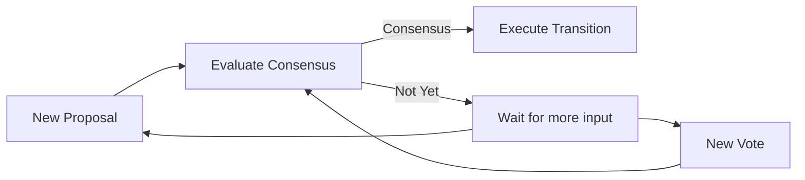

# Arbitration

**Arbitration** is the continuous process of evaluating consensus after every proposal and vote to determine when sufficient support exists to execute a transition.

## Overview

Consensus evaluation is **asynchronous and continuous**. Proposals and votes arrive in an uncontrolled, unbound manner—there is no defined order or timing. After each proposal submission and each vote cast, the arbiter re-evaluates whether any proposal has crossed the threshold:

```mermaid
graph LR
    P[New Proposal] --> A[Evaluate Consensus]
    V[New Vote] --> A
    A --> |Consensus| E[Execute Transition]
    A --> |Not Yet| W[Wait for more input]
    W --> P
    W --> V
```

Consensus is determined by the mathematics of the algorithm applied to the current state of proposals and votes, evaluated continuously rather than at a single point in time.

## The Arbiter

The arbiter is a fully deterministic, built-in component (see [Specialists — Arbiters](./specialists.md#arbiters)). It evaluates two things:

### 1. Guards (Deterministic)

Guards are deterministic checks that must pass before a transition can execute:

- **Proposal existence**: At least one proposal must exist for the current round
- **Ahead-by-k threshold**: The leading proposal must be ahead by `k` votes (configurable)
- **Round validity**: The round must still be active (not already completed)

Guards are pure logic—no LLM calls, no latency, no stochastic behavior.

### 2. Reasoning Synthesis (Optional)

When guards pass, the arbiter can optionally synthesize reasoning to explain the consensus decision. This reasoning is recorded in the transition history. It is informational and has no effect on the consensus determination.

## Built-in Strategies

DIAL ships with multiple [consensus strategies](./consensus-strategies.md). Some require voting (`aheadByK`, `pairwiseConsensus`), while others evaluate proposals directly (`firstProposal`, `mostSimilar`). The choice of strategy determines whether a voting phase occurs in the decision cycle.

### Ahead-by-K (Voting)

The default strategy implements **ahead-by-k voting**.

#### Rules

1. **Zero proposals**: No consensus

2. **One or more proposals**: Evaluate votes:
   - Tally votes per proposal (all votes count equally, including human votes)
   - The leading proposal must be ahead by `k` votes
   - A single proposal with no votes has no consensus—votes are still required for this strategy

### Vote Tallying

For each vote comparing proposals A and B:

| Vote | Effect |
|------|--------|
| **A** | Adds 1 to proposal A's tally |
| **B** | Adds 1 to proposal B's tally |
| **BOTH** | Adds 1 to both proposals' tallies |
| **NEITHER** | Adds nothing to either proposal |

If all voters vote NEITHER, no proposal reaches the threshold and consensus fails.

### Example

Consider two proposals being evaluated:

- **Proposal A** ("approve"): Receives votes from Voter 1 and Voter 2. Total: 2
- **Proposal B** ("request_changes"): Receives vote from Voter 3. Total: 1

Ahead by: 2 - 1 = 1

With k = 1: Consensus is reached (margin of 1 meets the threshold)

## Human Override

When consensus cannot be reached, only a human can force a decision. AI specialists cannot override the process. See [Human Primacy](./human-primacy.md) and [Specialists — Human vs AI](./specialists.md#human-vs-ai-specialists) for details.

## Configuring the Threshold

The `aheadByK` parameter controls how much support a proposal needs:

- **k=1** (default): Quick decisions, single vote margin
- **k=2+**: More robust consensus, requires broader agreement
- Higher values slow down decisions but reduce the chance of marginal wins

The threshold can be configured at the machine level (applies to all states) or per-state (overrides the machine default for specific decision points).

## When Consensus Fails

Specialists may not reach consensus, especially in complex scenarios. When this happens, the system surfaces the decision to a human. The inability to reach consensus indicates:

- The decision requires human judgment
- The specialists may need additional training or clearer instructions
- The problem space has genuine ambiguity that humans should resolve

This is how DIAL implements [Human Primacy](./human-primacy.md) in practice: humans don't need to monitor every decision, only the ones where specialists genuinely disagree.

## Best Practices

### 1. Start Simple

Begin with machines where decisions are straightforward. Add complexity (more proposers, higher k values) as you understand the decision landscape.

### 2. Monitor NEITHER Votes

High NEITHER rates or frequent consensus failures indicate:
- Decisions that genuinely require human judgment
- Poor proposal quality
- Unclear decision prompts
- Specialists that need additional training

### 3. Use Descriptive Reasoning

Clear reasoning in proposals and votes helps diagnose why consensus succeeds or fails.

### 4. Configure aheadByK Appropriately

Match the threshold to the stakes:
- Low-stakes, reversible decisions: k=1
- High-stakes, irreversible decisions: k=2+

## Related Concepts

- [Decision Cycle](./decision-cycle.md): Where arbitration fits
- [Specialists](./specialists.md): The actors that vote
- [Human Primacy](./human-primacy.md): Why humans override
