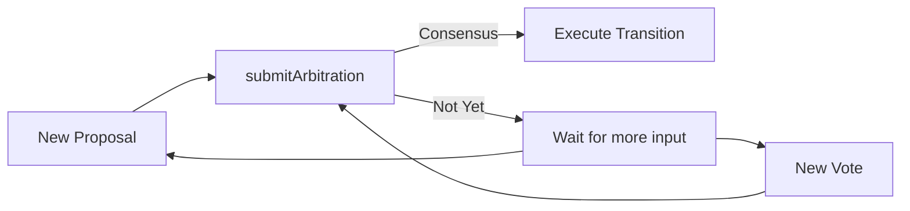

# Arbitration

**Arbitration** is the continuous process of evaluating consensus after every proposal and vote to determine when sufficient support exists to execute a transition.

## Overview

Consensus evaluation is **asynchronous and continuous**. Proposals and votes arrive in an uncontrolled, unbound manner—there is no defined order or timing. After each proposal submission and each vote cast, `submitArbitration` re-evaluates whether any proposal has crossed the threshold:


```mermaid
graph LR
    P[New Proposal] --> A[submitArbitration]
    V[New Vote] --> A
    A --> |Consensus| E[Execute Transition]
    A --> |Not Yet| W[Wait for more input]
    W --> P
    W --> V
```

The key insight is that it's not a specific point in time that decides consensus—it's the mathematics of the algorithm applied to the current state of proposals and votes.

## Guards vs Reasoning Synthesis

`submitArbitration` separates two concerns:

### 1. Guards (Deterministic)

Guards are deterministic checks that must pass before a transition can execute.

**When checking for consensus** (no `transitionName` provided):

1. **Round ID match**: The provided `roundId` must match `session.currentRoundId`. Stale submissions are rejected.
2. **Proposal existence**: At least one proposal must exist for the current round.
3. **Ahead-by-k threshold**: The leading proposal must be ahead by `k` votes (configurable per-state).

**When forcing a transition** (with `transitionName` provided):

1. **Round ID match**: The provided `roundId` must match `session.currentRoundId`.
2. **Human required**: The `specialistId` must refer to a specialist registered with `isHuman: true`.

Guards are pure logic—no LLM calls, no latency, no stochastic behavior.

### 2. Reasoning Synthesis (Optional)

When guards pass, the arbiter can optionally synthesize reasoning to explain the consensus decision. This is where an arbiter's `contextFn` or `modelId` comes into play:

- If the arbiter has a registered strategy, it is invoked to generate reasoning
- The reasoning is recorded in the transition history
- If no arbiter strategy is configured, a default reasoning is used

## Arbiter Configuration

The arbiter is configured at the machine level or per-state:

```typescript
const machine: MachineDefinition = {
  machineName: "document-review",
  initialState: "pending",
  defaultState: "approved",
  arbiter: {
    aheadByK: 1,           // default threshold
    modelId: "openai/gpt-4o-mini",  // optional: for reasoning synthesis
    contextFn: async (ctx) => {
      return `Summarize why ${ctx.winningProposal.transitionName} won`;
    },
  },
  states: {
    pending: {
      prompt: "Review the document",
      transitions: { approve: "approved", reject: "rejected" },
      arbiter: {
        aheadByK: 2,       // override: require larger margin for this state
      },
    },
    approved: {},
    rejected: {},
  },
};
```

### Arbiter Fields

| Field | Type | Default | Description |
|-------|------|---------|-------------|
| `aheadByK` | `number` | `1` | Votes the leader must be ahead by |
| `modelId` | `string` | — | LLM for reasoning synthesis |
| `contextFn` | `(ctx) => string` | — | Function to generate context for the LLM |

### Arbiter contextFn vs Specialist contextFn

Both arbiters and specialists can have a `contextFn`, but they serve different purposes:

| Component | contextFn Purpose | Input | Output |
|-----------|------------------|-------|--------|
| **Specialist** | Provides context to the LLM for making proposals/votes | `ProposerContext` or `VoterContext` | String context passed to the LLM |
| **Arbiter** | Generates reasoning to explain the consensus decision | `ArbitrationContext` with winning proposal | String reasoning recorded in transition history |

The arbiter's `contextFn` is called *after* consensus is reached, to synthesize an explanation. The specialist's `contextFn` is called *before* the LLM generates a proposal or vote, to provide decision context.

## The Built-in Arbiter: Ahead-by-K

DIAL ships with a built-in arbitration strategy that implements **ahead-by-k voting**.

### Rules

1. **Zero proposals**: No consensus (`guardsPass: false`)

2. **One or more proposals**: Evaluate votes:
   - Tally votes per proposal (all votes count equally, including human votes)
   - The leading proposal must be ahead by `k` votes
   - A single proposal with no votes has no consensus—votes are still required

The number of proposals (1 vs. N) doesn't change the fundamental requirement: sufficient support must be demonstrated through voting. A lone proposal doesn't automatically win.

Human votes count like any other vote during consensus evaluation. Human primacy is expressed through the ability to *force* a transition via `submitArbitration`—see [Human Override](#human-override-via-submitarbitration).

### Vote Tallying

For each vote comparing proposals A and B:

| Vote | Effect |
|------|--------|
| `"A"` | Adds 1 to proposal A's tally |
| `"B"` | Adds 1 to proposal B's tally |
| `"BOTH"` | Adds 1 to both proposals' tallies |
| `"NEITHER"` | Adds nothing to either proposal |

If all voters vote NEITHER, no proposal reaches the threshold and consensus fails.

### Example

```
Proposal A: "approve"
  - Voter 1 votes A
  - Voter 2 votes A
  Total for A: 2

Proposal B: "request_changes"
  - Voter 3 votes B
  Total for B: 1

Ahead by: 2 - 1 = 1

k = 1: Consensus reached (1 >= 1)
```


## Using submitArbitration

```typescript
import { submitArbitration } from "dialai";

const result = await submitArbitration(
  session.sessionId,
  session.currentRoundId
);

// Result shape:
// {
//   stale: boolean,
//   guardsPass: boolean,
//   guardReason: string,
//   winningProposalId?: string,
//   transitionName?: string,
//   toState?: string,
//   reasoning?: string,
//   executed: boolean,
//   metaJson?: Record<string, unknown>
// }
```

The `ArbitrationResult` type:

```typescript
interface ArbitrationResult {
  stale: boolean;              // roundId mismatch
  guardsPass: boolean;         // all guards passed
  guardReason: string;         // explanation if guards failed
  winningProposalId?: string;  // the winning proposal (if consensus)
  transitionName?: string;     // the transition to execute
  toState?: string;            // the target state
  reasoning?: string;          // synthesized or provided reasoning
  executed: boolean;           // whether transition was executed
  isHuman: boolean;            // was this a human-forced decision?
  metaJson?: Record<string, unknown>;
}
```

## Human Override via submitArbitration

When consensus isn't reached, a human can force a decision by calling `submitArbitration` with an explicit `transitionName`. This requires passing a `specialistId` that was registered with `isHuman: true`:

```typescript
// Human decides to approve directly
const result = await submitArbitration(
  session.sessionId,
  session.currentRoundId,
  "human-reviewer",  // must be registered with isHuman: true
  "approve",
  "Reviewed and approved by legal team"
);

console.log(result.executed); // true
```

If an AI specialist attempts to force a transition, it is rejected:

```typescript
// This fails - only humans can force arbitration
const result = await submitArbitration(
  session.sessionId,
  session.currentRoundId,
  "ai-specialist",  // not registered with isHuman: true
  "approve",
  "I think we should approve"
);

console.log(result.executed);   // false
console.log(result.guardReason); // "Only human specialists can force arbitration"
```

This is the mechanism for [Human Primacy](./human-primacy.md):
- Humans participate in voting like anyone else
- When AI cannot reach consensus, humans break the deadlock
- Only humans can force a decision—AI cannot override the process

## The Engine's Behavior

When using `runSession`, the engine handles arbitration automatically with continuous evaluation:

1. **After each proposal**: `submitArbitration` checks if any proposal has sufficient support
2. **After each vote**: `submitArbitration` re-evaluates; voting stops as soon as the ahead-by-k threshold is met
3. **Swiss tournament pairing**: For multiple proposals, the engine matches proposals with similar accumulated support first. It round-robins through registered voters. The O(N²) full comparison is the worst case, not the typical case.
4. **No consensus**: If no proposal crosses the threshold after all available voters are exhausted, the engine signals that human input is required

### When AIs Cannot Reach Consensus

It is entirely possible—and expected in complex scenarios—that AI specialists will **not** reach consensus on their own. This is not a failure; it's a feature.

When AI voters are split or vote NEITHER, the system naturally surfaces the decision to a human. The inability to reach consensus is an indicator that:

- The decision requires human judgment
- The specialists may need additional training or clearer instructions
- The problem space has genuine ambiguity that humans should resolve

This is how DIAL implements [Human Primacy](./human-primacy.md) in practice: humans don't need to monitor every decision, only the ones where AI specialists genuinely disagree.

## Best Practices

### 1. Start with Simple Machines

Begin with machines where the built-in deterministic proposer can navigate to the goal. Add additional proposers and voters as complexity grows.

### 2. Use Descriptive Reasoning

Always include clear reasoning in proposals and votes:

```typescript
// Good
{ voteFor: "A", reasoning: "Proposal A moves to done state, which is the goal" }

// Bad
{ voteFor: "A", reasoning: "A" }
```

### 3. Monitor NEITHER Votes and Consensus Failures

High NEITHER rates or frequent consensus failures indicate:
- Decisions that genuinely require human judgment
- Poor proposal quality
- Unclear decision prompts
- Specialists that need additional training
- The need to refine specialist instructions based on patterns of disagreement

### 4. Configure aheadByK Appropriately

- `k=1` (default): Quick decisions, single vote margin
- `k=2+`: More robust consensus, requires broader agreement
- Higher values slow down decisions but reduce the chance of marginal wins

## Related Concepts

- [Decision Cycle](./decision-cycle.md): Where arbitration fits
- [Specialists](./specialists.md): Voting
- [Human Primacy](./human-primacy.md): Why humans override
