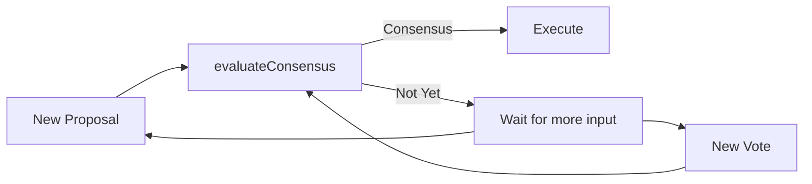

# Arbitration

**Arbitration** is the continuous process of evaluating consensus after every proposal and vote to determine when sufficient support exists to execute a transition.

## Overview

Consensus evaluation is not a one-time event—it runs continuously as the decision cycle progresses. After each proposal submission and each vote cast, `evaluateConsensus` re-evaluates whether any proposal has crossed the threshold:


```mermaid
graph LR
    P[New Proposal] --> A[evaluateConsensus]
    V[New Vote] --> A
    A --> |Consensus| E[Execute]
    A --> |Not Yet| W[Wait for more input]
    W --> P
    W --> V
```

The key insight is that it's not a specific point in time that decides consensus—it's the mathematics of the algorithm applied to the current state of proposals and votes.

## The Built-in Arbiter: Ahead-by-K

DIAL ships with a built-in arbitration strategy that implements **voting with human override**.

### Rules

1. **Zero proposals**: No consensus (`consensusReached: false`)

2. **One or more proposals**: Evaluate votes:
   - If any human has voted, their choice wins immediately
   - Otherwise, tally votes per proposal
   - The leading proposal must be ahead by `k = 1` votes
   - A single proposal with no votes has no consensus—votes are still required

The number of proposals (1 vs. N) doesn't change the fundamental requirement: sufficient support must be demonstrated through voting. A lone proposal doesn't automatically win.

### Vote Tallying

For each vote comparing proposals A and B:

| Vote | Effect |
|------|--------|
| `"A"` | Adds 1 to proposal A's tally |
| `"B"` | Adds 1 to proposal B's tally |
| `"BOTH"` | Adds 1 to both proposals' tallies |
| `"NEITHER"` | Adds nothing to either proposal |

If all voters vote NEITHER, no proposal reaches the threshold and consensus fails.

### Example

```
Proposal A: "approve"
  - Voter 1 votes A
  - Voter 2 votes A
  Total for A: 2

Proposal B: "request_changes"
  - Voter 3 votes B
  Total for B: 1

Ahead by: 2 - 1 = 1

k = 1: Consensus reached (1 >= 1)
```

### Human Override

When a human votes, the calculation short-circuits:

```
Proposal A: "approve"
  - AI Voter 1 votes A
  - AI Voter 2 votes A

Proposal B: "request_changes"
  - Human Voter votes B

Result: B wins immediately

Human primacy: AI votes don't matter when a human participates.
```

A specialist is considered "human" if their `specialistId` contains "human" (case-insensitive).

## Using evaluateConsensus

```typescript
import { evaluateConsensus } from "dialai";

const result = evaluateConsensus("session-123");

// Result shape:
// {
//   consensusReached: boolean,
//   winningProposalId?: string,
//   reasoning: string
// }
```

The `ConsensusResult` type:

```typescript
interface ConsensusResult {
  consensusReached: boolean;
  winningProposalId?: string;
  reasoning: string;
}
```

## The Engine's Behavior

When using `runSession`, the engine handles arbitration automatically with continuous evaluation:

1. **After each proposal**: `evaluateConsensus` checks if any proposal has sufficient support
2. **After each vote**: `evaluateConsensus` re-evaluates; voting stops as soon as the ahead-by-k threshold is met
3. **Swiss tournament pairing**: For multiple proposals, the engine matches proposals with similar accumulated support first. It round-robins through registered voters. The O(N²) full comparison is the worst case, not the typical case.
4. **No consensus**: If no proposal crosses the threshold after all available voters are exhausted, the engine signals that human input is required

### When AIs Cannot Reach Consensus

It is entirely possible—and expected in complex scenarios—that AI specialists will **not** reach consensus on their own. This is not a failure; it's a feature.

When AI voters are split or vote NEITHER, the system naturally surfaces the decision to a human. The inability to reach consensus is an indicator that:

- The decision requires human judgment
- The specialists may need additional training or clearer instructions
- The problem space has genuine ambiguity that humans should resolve

This is how DIAL implements [Human Primacy](./human-primacy.md) in practice: humans don't need to monitor every decision, only the ones where AI specialists genuinely disagree.

## Best Practices

### 1. Start with Simple Machines

Begin with machines where the built-in deterministic proposer can navigate to the goal. Add additional proposers and voters as complexity grows.

### 2. Use Descriptive Reasoning

Always include clear reasoning in proposals and votes:

```typescript
// Good
{ voteFor: "A", reasoning: "Proposal A moves to done state, which is the goal" }

// Bad
{ voteFor: "A", reasoning: "A" }
```

### 3. Monitor NEITHER Votes and Consensus Failures

High NEITHER rates or frequent consensus failures indicate:
- Decisions that genuinely require human judgment
- Poor proposal quality
- Unclear decision prompts
- Specialists that need additional training
- The need to refine specialist instructions based on patterns of disagreement

## Related Concepts

- [Decision Cycle](./decision-cycle.md): Where arbitration fits
- [Specialists](./specialists.md): Voting
- [Human Primacy](./human-primacy.md): Why humans override
