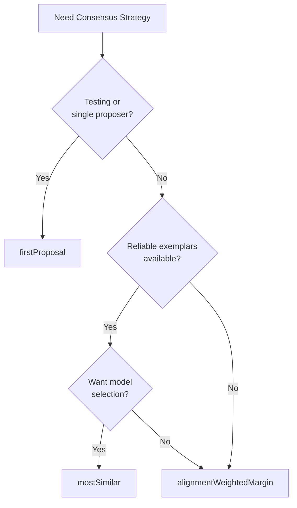

# Consensus Strategies

DIAL's default consensus mechanism is the **Alignment-Weighted Margin of Superiority** algorithm — a unified approach where every specialist contribution (proposal, selection vote, pairwise vote) feeds into a single consensus score per transition. DIAL also ships with simpler strategies for specific use cases.

## Overview

| Strategy | Voting Required | Best For | Key Parameter |
|----------|:---------------:|----------|---------------|
| `alignmentWeightedMargin` | Optional | **Default.** General use, progressive collapse | `consensus_threshold` (0.0–1.0) |
| `firstProposal` | No | Testing, single-proposer, bootstrap | — |
| `mostSimilar` | No | States with reliable exemplars | Minimum similarity (0.0–1.0) |

## `alignmentWeightedMargin` *(Default)*

The default strategy. Every contribution adds the specialist's alignment score to the transition it supports. Consensus is reached when one transition is sufficiently ahead of the rest.

### When to Use

- **Always**, unless you have a specific reason to use a simpler strategy
- Production systems with multiple specialists
- Any scenario where progressive collapse is desired
- When you want the system to naturally adapt as alignment improves

### How It Works

#### Step 1: Score Each Transition

As proposals and votes arrive, the arbiter accumulates a score for each transition:

```
score(T) = Σ alignment_i × support_i(T)
```

Every type of contribution adds to the transition score:

| Contribution | What it supports |
|-------------|-----------------|
| **Proposal** for transition T | Adds `alignment_proposer` to score(T) |
| **Selection vote** for a proposal targeting T | Adds `alignment_voter` to score(T) |
| **Pairwise vote A** (where A targets T) | Adds `alignment_voter` to score(T) |
| **Pairwise vote BOTH** (both target T) | Adds `alignment_voter` to score(T) |
| **Pairwise vote BOTH** (A targets T, B targets U) | Adds `alignment_voter × 0.5` to score(T) and score(U) |
| **Pairwise vote NEITHER** | Adds nothing |

#### Step 2: Calculate Margin of Superiority

```
margin = (score(leader) − score(runner_up)) / Σ alignment_i
```

The margin is normalized by total alignment in play, so it's always between 0 and 1 regardless of how many specialists participate.

#### Step 3: Check Threshold

```
consensus when: margin ≥ consensus_threshold
```

The **consensus threshold** is the **risk dial** — a state-level parameter that controls how much superiority is required.

### Algorithm

```
function alignmentWeightedMargin(ctx) -> ConsensusResult:
    if len(ctx.proposals) == 0:
        return { consensusReached: false, reasoning: "No proposals" }

    # Group proposals by transition
    transition_scores = {}
    total_alignment = 0

    for proposal in ctx.proposals:
        T = proposal.transitionName
        a = alignment(proposal.specialistId)
        transition_scores[T] = transition_scores.get(T, 0) + a
        total_alignment += a

    for vote in ctx.selectionVotes:
        T = voted_proposal.transitionName
        a = alignment(vote.specialistId)
        transition_scores[T] = transition_scores.get(T, 0) + a
        total_alignment += a

    for vote in ctx.pairwiseVotes:
        a = alignment(vote.specialistId)
        total_alignment += a
        if vote.choice == "A":
            T = vote.proposalA.transitionName
            transition_scores[T] += a
        elif vote.choice == "B":
            T = vote.proposalB.transitionName
            transition_scores[T] += a
        elif vote.choice == "BOTH":
            T_a = vote.proposalA.transitionName
            T_b = vote.proposalB.transitionName
            if T_a == T_b:
                transition_scores[T_a] += a
            else:
                transition_scores[T_a] += a * 0.5
                transition_scores[T_b] += a * 0.5
        # NEITHER: no score added

    if total_alignment == 0:
        return { consensusReached: false, reasoning: "No alignment data" }

    # Find leader and runner-up
    sorted_transitions = sorted(transition_scores.items(), by: value, desc: true)
    leader_name, leader_score = sorted_transitions[0]
    runner_up_score = sorted_transitions[1][1] if len(sorted_transitions) > 1 else 0

    margin = (leader_score - runner_up_score) / total_alignment

    if margin >= ctx.consensus_threshold:
        # Find the best proposal for the winning transition
        best_proposal = highest_alignment_proposal(ctx.proposals, leader_name)
        return {
            consensusReached: true,
            winningProposalId: best_proposal.proposalId,
            reasoning: f"Margin {margin:.2f} ≥ threshold {ctx.consensus_threshold}"
        }

    return {
        consensusReached: false,
        reasoning: f"Margin {margin:.2f} < threshold {ctx.consensus_threshold}"
    }
```

### Proposal Clustering

When multiple proposers choose the same transition, their alignment scores **combine** rather than compete. This is a natural consequence of scoring by transition: "approve" from Proposer A and "approve" from Proposer B both add to `score("approve")`.

This has important implications:
- Two moderately-aligned specialists agreeing on a transition can generate more consensus than one highly-aligned specialist alone
- Agreement among specialists is rewarded — it's a signal that the transition is correct
- Disagreement is also informative — two highly-aligned specialists proposing different transitions produces a low margin, surfacing genuine ambiguity

### The Cold Start Problem

When all AI specialists have alignment = 0:
- Every contribution adds 0 to the score
- `total_alignment = 0`, so the margin is undefined (treated as 0)
- Consensus is impossible
- The system blocks for a human decision

This is intentional: the system cannot delegate until humans have provided ground truth.

### Worked Example: Progressive Consensus

**Round 1** (cold start — all alignment = 0):

| Specialist | Action | Alignment | Contribution |
|-----------|--------|-----------|-------------|
| Proposer A | propose "approve" | 0.0 | 0.0 |
| Proposer B | propose "reject" | 0.0 | 0.0 |

Scores: approve = 0, reject = 0. **Blocked.** Human forces "approve."

**Round 5** (after calibration):

| Specialist | Action | Alignment | Contribution |
|-----------|--------|-----------|-------------|
| Proposer A | propose "approve" | 0.8 | 0.8 |
| Proposer B | propose "approve" | 0.6 | 0.6 |
| Sel. Voter C | picks Proposer A's proposal | 0.7 | 0.7 |

Scores: approve = 0.8 + 0.6 + 0.7 = **2.1**, no runner-up.

```
margin = (2.1 − 0) / (0.8 + 0.6 + 0.7) = 2.1 / 2.1 = 1.0
```

With threshold = 0.5: ✅ Consensus reached at selection voting. Pairwise voters never solicited.

**Round 50** (champion mode):

| Specialist | Action | Alignment | Contribution |
|-----------|--------|-----------|-------------|
| Proposer A | propose "approve" | 0.95 | 0.95 |

All other proposers and voters have been disabled (pruned).

```
margin = (0.95 − 0) / 0.95 = 1.0
```

Consensus reached on proposals alone. No voting at all.

## `firstProposal`

The simplest strategy: immediately declares consensus on the first valid proposal received. No voting, no alignment scoring.

### When to Use

- Testing and development
- Single-proposer scenarios
- Bootstrap phase before any specialists are trained
- Deterministic pipelines where deliberation adds no value

### Algorithm

```
function firstProposal(ctx) -> ConsensusResult:
    if len(ctx.proposals) == 0:
        return { consensusReached: false, reasoning: "No proposals" }

    first = sorted(ctx.proposals, by: createdAt, ascending: true)[0]

    return {
        consensusReached: true,
        winningProposalId: first.proposalId,
        reasoning: f"First proposal wins (from {first.specialistId})"
    }
```

### Trade-offs

**Advantages:**
- Zero latency: no waiting for votes
- Simple to reason about

**Disadvantages:**
- No deliberation: ignores all other proposals
- No alignment signal: provides no data for measuring specialist quality
- Bypasses DIAL's core value proposition

## `mostSimilar`

Compares each proposal to human gold examples (exemplars) using semantic similarity. The proposal most similar to past human decisions wins. No voting required.

### When to Use

- You have reliable exemplars for this state
- Semantic similarity provides clear, unambiguous scores
- You want fast decisions without voting overhead
- Model selection scenarios (finding the best model for a state)

### Algorithm

```
function mostSimilar(ctx) -> ConsensusResult:
    if ctx.exemplars is empty:
        return { consensusReached: false, reasoning: "No exemplars" }

    scores = []
    for proposal in ctx.proposals:
        similarity = max(
            semantic_similarity(proposal.reasoning, exemplar.reasoning)
            for exemplar in ctx.exemplars
        )
        scores.append({ proposalId: proposal.proposalId, similarity })

    scores.sort(by: similarity, descending: true)

    if scores[0].similarity < ctx.threshold:
        return {
            consensusReached: false,
            reasoning: f"Best similarity {scores[0].similarity} below threshold {ctx.threshold}"
        }

    # Check for clear winner
    if len(scores) >= 2:
        gap = scores[0].similarity - scores[1].similarity
        if gap < 0.05:
            return {
                consensusReached: false,
                reasoning: f"No clear winner: top two within {gap} similarity"
            }

    return {
        consensusReached: true,
        winningProposalId: scores[0].proposalId,
        reasoning: f"Most similar to exemplar (similarity: {scores[0].similarity})"
    }
```

## Custom Strategies

You can implement custom consensus strategies using `strategyFn`:

```typescript
registerArbiter({
  specialistId: "custom-arbiter",
  machineName: "my-task",
  strategyFn: async (ctx: ArbiterContext) => {
    const winner = myCustomConsensusLogic(ctx.proposals, ctx.votes);

    if (winner) {
      return {
        consensusReached: true,
        winningProposalId: winner.proposalId,
        reasoning: "Custom consensus reached",
      };
    }

    return {
      consensusReached: false,
      reasoning: "Custom consensus not reached",
    };
  },
});
```

Custom strategies must be deterministic — given the same inputs, they must produce the same outputs.

## Strategy Selection



| Scenario | Recommended Strategy |
|----------|---------------------|
| Production use, general | `alignmentWeightedMargin` |
| Progressive collapse desired | `alignmentWeightedMargin` |
| Testing, dev, bootstrap | `firstProposal` |
| Model selection against exemplars | `mostSimilar` |
| Unknown/varying conditions | `alignmentWeightedMargin` |

## Progressive Collapse

With `alignmentWeightedMargin`, progressive collapse happens naturally within the same algorithm:

1. **Cold start**: All alignment = 0. Score is always 0. System blocks for human. Human decisions generate exemplars.
2. **Calibration**: Alignment scores grow. Contributions start adding nonzero amounts to transition scores. The system may still need voters to reach the threshold.
3. **Autonomous consensus**: High-alignment proposers generate enough score from proposals alone that selection and pairwise voting are never needed.
4. **Pruning**: Low-alignment and redundant specialists are disabled. Cost drops. Fewer solicitations per round.
5. **Champion**: One highly-aligned specialist handles the task solo. Consensus is immediate from a single proposal.
6. **Collapsed**: A fine-tuned, cheap model replaces the original specialist. Same alignment, fraction of the cost.

The strategy never changes — the same `alignmentWeightedMargin` algorithm handles every stage. What changes is the **alignment scores** feeding into it.

## Related Concepts

- [Arbitration](./arbitration.md): The arbiter's role in evaluating consensus
- [Specialists](./specialists.md): How specialists participate
- [Human Primacy](./human-primacy.md): Why human gold examples are ground truth
- [Decision Cycle](./decision-cycle.md): Where consensus evaluation fits
