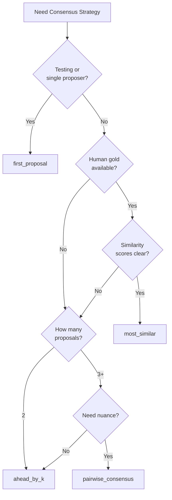

# Consensus Strategies

DIAL provides three built-in consensus strategies for arbiters. Each strategy determines when consensus has been reached and which proposal wins. Strategies are stored in `src/strategies/arbiters/` and referenced by name via `strategyFnName`.

## Overview

| Strategy | Voting Required | Best For | Threshold Meaning |
|----------|:---------------:|----------|-------------------|
| `first_proposal` | No | Testing, single-proposer, bootstrap | -- |
| `most_similar` | No | States with reliable human gold examples | Minimum semantic similarity (0.0–1.0) |
| `ahead_by_k` | Yes (ranked) | Fast preference aggregation | Vote lead required (integer) |
| `pairwise_consensus` | Yes (pairwise) | Nuanced/complex decisions | Agreement percentage (0.0–1.0) |

## `first_proposal`

The simplest arbiter strategy: immediately declares consensus on the first proposal received. No voting phase, no comparison—the first proposal wins.

### When to Use

- Testing and development environments
- Single-proposer scenarios where voting adds no value
- Low-stakes decisions where speed matters more than deliberation
- Bootstrap phase before specialists are trained
- Baseline comparison for measuring more sophisticated strategies

### Configuration

```typescript
registerArbiter({
  specialistId: "fast-arbiter",
  machineName: "simple-task",
  strategyFnName: "first_proposal",
  // No threshold needed
});
```

### Algorithm

```
function first_proposal(ctx: ArbiterContext) -> ConsensusResult:
    if len(ctx.proposals) == 0:
        return {
            consensusReached: false,
            reasoning: "No proposals received"
        }

    # Sort by creation timestamp and take the first
    sorted_proposals = sorted(ctx.proposals, by: createdAt, ascending: true)
    first = sorted_proposals[0]

    return {
        consensusReached: true,
        winningProposalId: first.proposalId,
        reasoning: f"First proposal received wins (from {first.specialistId})"
    }
```

### Trade-offs

**Advantages:**
- Zero latency: no waiting for votes
- Deterministic: same proposals always produce same result
- Simple to reason about

**Disadvantages:**
- No deliberation: ignores all other proposals
- Order-dependent: whoever submits first wins
- No alignment signal: provides no data for measuring specialist quality

### Use with Caution

This strategy bypasses DIAL's core value proposition (measured consensus). Use it only when:
1. You genuinely don't need deliberation
2. You're testing/debugging the system
3. You're measuring baseline performance

For production use cases, prefer `ahead_by_k` (with k=1 for speed) or `most_similar` (for alignment measurement).

## `most_similar`

Compares each proposal directly to human gold examples using semantic similarity. No voting phase required—the proposal most similar to human gold wins.

### When to Use

- You have reliable human gold examples for this state
- Semantic similarity provides clear, unambiguous scores
- Your goal is model selection, not consensus-building
- You want fast decisions without voting overhead

### Configuration

```typescript
registerArbiter({
  specialistId: "similarity-arbiter",
  machineName: "document-review",
  strategyFnName: "most_similar",
  threshold: 0.85,  // minimum similarity to declare winner
});
```

### Algorithm

```
function most_similar(ctx: ArbiterContext) -> ConsensusResult:
    if ctx.humanGoldExamples is empty:
        return { consensusReached: false, reasoning: "No human gold examples available" }

    scores = []
    for proposal in ctx.proposals:
        similarity = max(
            semantic_similarity(proposal.reasoning, gold.reasoning)
            for gold in ctx.humanGoldExamples
        )
        scores.append({ proposalId: proposal.proposalId, similarity })

    # Sort by similarity descending
    scores.sort(by: similarity, descending: true)

    if scores[0].similarity < ctx.threshold:
        return {
            consensusReached: false,
            reasoning: f"Best similarity {scores[0].similarity} below threshold {ctx.threshold}"
        }

    # Check for clear winner (if multiple proposals)
    if len(scores) >= 2:
        gap = scores[0].similarity - scores[1].similarity
        if gap < 0.05:  # configurable minimum gap
            return {
                consensusReached: false,
                reasoning: f"No clear winner: top two within {gap} similarity"
            }

    return {
        consensusReached: true,
        winningProposalId: scores[0].proposalId,
        reasoning: f"Proposal most similar to human gold (similarity: {scores[0].similarity})"
    }
```

### Semantic Similarity

The `semantic_similarity` function computes similarity between two reasoning strings. Implementation options:

- **Embedding cosine similarity**: Embed both strings, compute cosine distance
- **LLM-based scoring**: Ask an LLM to rate similarity (deterministic with temperature=0)
- **Hybrid**: Embedding for speed, LLM for disambiguation

```typescript
async function semanticSimilarity(a: string, b: string): Promise<number> {
  const embeddingA = await embed(a);
  const embeddingB = await embed(b);
  return cosineSimilarity(embeddingA, embeddingB);
}
```

## `ahead_by_k`

Requires a proposal to be ahead by k votes to win. Specialists vote by ranking all proposals; the top-ranked proposal from each voter gets +1.

### When to Use

- You want fast preference aggregation
- Voting is acceptable overhead
- You need a simple, understandable threshold
- Multi-stakeholder participation

### Configuration

```typescript
registerArbiter({
  specialistId: "voting-arbiter",
  machineName: "triage-task",
  strategyFnName: "ahead_by_k",
  threshold: 2,  // must be ahead by 2 votes
});
```

### Algorithm

```
function ahead_by_k(ctx: ArbiterContext) -> ConsensusResult:
    if len(ctx.proposals) == 0:
        return { consensusReached: false, reasoning: "No proposals" }

    if len(ctx.proposals) == 1:
        # Single proposal: check if it has enough support
        support = count_votes_for(ctx.votes, ctx.proposals[0].proposalId)
        if support >= ctx.threshold:
            return {
                consensusReached: true,
                winningProposalId: ctx.proposals[0].proposalId,
                reasoning: f"Single proposal with {support} votes"
            }
        return { consensusReached: false, reasoning: f"Single proposal needs {ctx.threshold} votes, has {support}" }

    # Multiple proposals: tally votes
    tallies = {}
    for proposal in ctx.proposals:
        tallies[proposal.proposalId] = 0

    for vote in ctx.votes:
        # In ranked voting, voteFor indicates the preferred proposal
        if vote.voteFor == "A":
            tallies[vote.proposalIdA] += 1
        elif vote.voteFor == "B":
            tallies[vote.proposalIdB] += 1
        elif vote.voteFor == "BOTH":
            tallies[vote.proposalIdA] += 1
            tallies[vote.proposalIdB] += 1
        # NEITHER adds nothing

    # Sort by tally descending
    sorted_tallies = sorted(tallies.items(), by: value, descending: true)

    leader_id, leader_votes = sorted_tallies[0]
    runner_up_votes = sorted_tallies[1][1] if len(sorted_tallies) > 1 else 0

    lead = leader_votes - runner_up_votes

    if lead >= ctx.threshold:
        return {
            consensusReached: true,
            winningProposalId: leader_id,
            reasoning: f"Ahead by {lead} votes (threshold: {ctx.threshold})"
        }

    return {
        consensusReached: false,
        reasoning: f"Lead of {lead} below threshold {ctx.threshold}"
    }
```

## `pairwise_consensus`

Performs repeated pairwise comparisons between proposals. Each pair is voted on; the winner of each matchup advances. Consensus is reached when one proposal has won a sufficient percentage of its matchups.

### When to Use

- Decisions are nuanced and require careful comparison
- You want rich voting data for alignment measurement
- Stakes are high enough to justify extra voting rounds
- Proposals may have subtle differences

### Configuration

```typescript
registerArbiter({
  specialistId: "consensus-arbiter",
  machineName: "complex-decision",
  strategyFnName: "pairwise_consensus",
  threshold: 0.75,  // must win 75% of matchups
});
```

### Algorithm

```
function pairwise_consensus(ctx: ArbiterContext) -> ConsensusResult:
    if len(ctx.proposals) == 0:
        return { consensusReached: false, reasoning: "No proposals" }

    if len(ctx.proposals) == 1:
        return {
            consensusReached: true,
            winningProposalId: ctx.proposals[0].proposalId,
            reasoning: "Single proposal"
        }

    # Build matchup results from votes
    # Each vote is a pairwise comparison between proposalIdA and proposalIdB
    wins = {}
    matchups = {}

    for proposal in ctx.proposals:
        wins[proposal.proposalId] = 0
        matchups[proposal.proposalId] = 0

    for vote in ctx.votes:
        matchups[vote.proposalIdA] += 1
        matchups[vote.proposalIdB] += 1

        if vote.voteFor == "A":
            wins[vote.proposalIdA] += 1
        elif vote.voteFor == "B":
            wins[vote.proposalIdB] += 1
        elif vote.voteFor == "BOTH":
            wins[vote.proposalIdA] += 0.5
            wins[vote.proposalIdB] += 0.5
        # NEITHER: no wins awarded

    # Calculate win rate for each proposal
    win_rates = {}
    for proposal_id in wins:
        if matchups[proposal_id] > 0:
            win_rates[proposal_id] = wins[proposal_id] / matchups[proposal_id]
        else:
            win_rates[proposal_id] = 0

    # Find the proposal with highest win rate
    sorted_rates = sorted(win_rates.items(), by: value, descending: true)

    leader_id, leader_rate = sorted_rates[0]

    if leader_rate >= ctx.threshold:
        return {
            consensusReached: true,
            winningProposalId: leader_id,
            reasoning: f"Won {leader_rate*100:.0f}% of matchups (threshold: {ctx.threshold*100:.0f}%)"
        }

    return {
        consensusReached: false,
        reasoning: f"Best win rate {leader_rate*100:.0f}% below threshold {ctx.threshold*100:.0f}%"
    }
```

### Pairwise Scheduling

For N proposals, there are N×(N-1)/2 possible pairings. The arbiter can:

1. **Exhaustive**: Run all pairings before evaluating (most data, slowest)
2. **Early exit**: Evaluate after each vote, stop when threshold reached (faster)
3. **Round-robin**: Cycle through pairings, evaluate periodically

## Custom Strategies

You can implement custom consensus strategies using `strategyFn`:

```typescript
registerArbiter({
  specialistId: "custom-arbiter",
  machineName: "my-task",
  strategyFn: async (ctx: ArbiterContext) => {
    // Your custom logic here
    const winner = myCustomConsensusLogic(ctx.proposals, ctx.votes);

    if (winner) {
      return {
        consensusReached: true,
        winningProposalId: winner.proposalId,
        reasoning: "Custom consensus reached",
      };
    }

    return {
      consensusReached: false,
      reasoning: "Custom consensus not reached",
    };
  },
});
```

Custom strategies must be deterministic—given the same inputs, they must produce the same outputs.

## Strategy Selection Guidelines



| Scenario | Recommended Strategy |
|----------|---------------------|
| Testing, dev, bootstrap | `first_proposal` |
| Single proposer, no deliberation needed | `first_proposal` |
| Reliable human gold examples | `most_similar` |
| Fast triage, clear preferences | `ahead_by_k` |
| Complex decisions, subtle differences | `pairwise_consensus` |
| Unknown/varying conditions | Start with `pairwise_consensus`, collapse to simpler |

## Progressive Collapse

As alignment improves, systems naturally collapse toward simpler strategies:

1. **Start**: `pairwise_consensus` (maximum data collection)
2. **Improve**: Models learn from voting patterns
3. **Simplify**: Switch to `ahead_by_k` (less overhead)
4. **Optimize**: When gold examples are reliable, use `most_similar` (no voting)
5. **Collapse**: Eventually, a single well-aligned model runs deterministically

This progression is a natural outcome of measuring and optimizing alignment over time.

## Related Concepts

- [Arbitration](./arbitration.md): The role of arbiters in the decision cycle
- [Alignment vs. Voting](./alignment-vs-voting.md): When to use direct alignment vs. voting
- [Human Primacy](./human-primacy.md): Why human gold examples are ground truth
- [Registering Specialists](/docs/guides/registering-specialists): How to register arbiters
