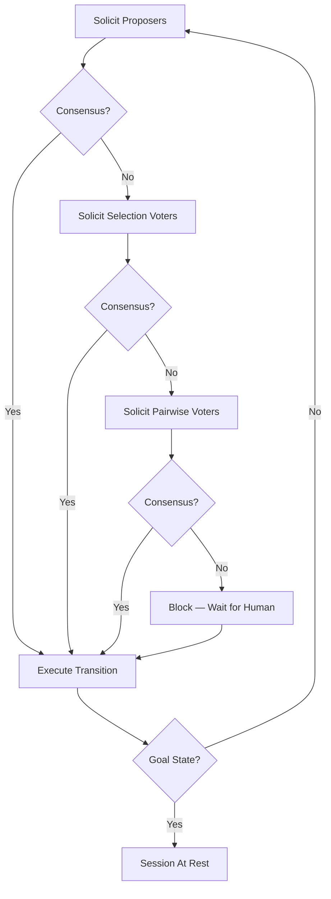

# Decision Cycle

When a session is not in its goal state, the **arbiter** drives a decision cycle that orchestrates specialists to find consensus on the next transition.

## Asynchronous by Design

The decision cycle is **asynchronous**: the arbiter solicits contributions from specialists at a steady pace, but contributions arrive on their own schedule. A webhook-based voter might respond in milliseconds; a human might take hours. The arbiter doesn't wait for stragglers — it re-evaluates the **consensus score** after every arriving contribution and declares consensus the moment the threshold is met.

This design accommodates:
- **Heterogeneous response times**: Fast AI models respond in seconds; humans may take hours or days
- **Distributed specialists**: Webhook-based specialists may be across networks with variable latency
- **Early resolution**: If three proposers all choose the same transition with high alignment, consensus may be reached before any voter is even solicited

## The Arbiter's Sequence

The arbiter works through a solicitation sequence at a steady clip. It doesn't wait for one phase to complete before starting the next — it continuously evaluates consensus as contributions arrive.



### Phase 1: Solicit Proposers

The arbiter requests proposals from all enabled proposers. Each proposal includes:
- The **transition name** (which edge in the state machine)
- **Reasoning** (natural language explanation)
- **MetaJSON** (structured state description)

The arbiter **validates** each proposal as it arrives — invalid transitions are rejected. Valid proposals are **clustered by transition**: if two proposers both suggest "approve," their contributions support the same transition.

After each valid proposal arrives, the arbiter re-evaluates consensus. If the margin of superiority already crosses the threshold (e.g., one transition is supported by highly-aligned specialists while no other transition has been proposed), execution begins immediately.

### Phase 2: Solicit Selection Voters

If proposals alone don't produce consensus, the arbiter solicits **selection voters**. Each selection voter sees all valid proposals and picks the one they believe is strongest.

Each selection vote adds the voter's alignment score to the chosen proposal's transition score.

### Phase 3: Solicit Pairwise Voters

If selection voting still doesn't produce consensus, the arbiter solicits **pairwise voters**. Each pairwise voter evaluates two proposals head-to-head:

| Vote | Effect on Consensus Score |
|------|--------------------------|
| **A** | Adds voter's alignment to proposal A's transition |
| **B** | Adds voter's alignment to proposal B's transition |
| **BOTH** | Splits voter's alignment evenly between both |
| **NEITHER** | Adds nothing |

### Phase 4: Block for Human

If the arbiter has solicited all enabled proposers, selection voters, and pairwise voters — and consensus still hasn't been reached — the system **blocks**. This is not a failure; it means more training data is needed. The task waits for a human to force a decision, which:

1. Immediately advances the session to the next state
2. Creates an **exemplar** (full context + human choice) for future learning
3. Updates alignment scores for all specialists who participated

## Consensus Evaluation

The arbiter maintains a **unified consensus score** for each transition that has been proposed. Every contribution adds to the score of the transition it supports, multiplied by the contributing specialist's alignment score.

```
score(transition) = Σ alignment_i × support_i(transition)
```

The arbiter calculates the **margin of superiority** — how far the leading transition is ahead of the runner-up, normalized by total alignment:

```
margin = (score(leader) − score(runner_up)) / Σ alignment_i
```

Consensus is reached when `margin ≥ consensus_threshold`, where the threshold is controlled by the **risk dial** (a state-level parameter between 0.0 and 1.0).

See [Arbitration](./arbitration.md) for the full algorithm, including proposal clustering and self-healing.

## When Contributions Arrive Late

Because the cycle is asynchronous, contributions may arrive after consensus has been declared or after the round has ended. Late arrivals are ignored for the completed round but still provide useful data:

- **Alignment measurement**: The late specialist's choice can still be compared to the human-chosen outcome to update alignment scores
- **No harm**: A late vote cannot retroactively change a completed transition

## The Continuous Nature

The arbiter doesn't process phases in strict sequence. It sends solicitations at a steady pace and continuously processes responses:

1. Sends `submitProposal` to Proposer A
2. Sends `submitProposal` to Proposer B
3. Proposer A responds → arbiter evaluates consensus
4. Sends `submitVote` to Selection Voter C
5. Proposer B responds → arbiter re-evaluates
6. Selection Voter C responds → arbiter re-evaluates → consensus reached!
7. Pairwise voters are never solicited because consensus was reached earlier

Meanwhile, humans may be proposing and voting through the UI at any time. Their contributions flow into the same consensus evaluation.

## Related Concepts

- [Arbitration](./arbitration.md): The consensus score algorithm and self-healing
- [Specialists](./specialists.md): The actors that propose and vote
- [Human Primacy](./human-primacy.md): Why humans override when consensus fails
