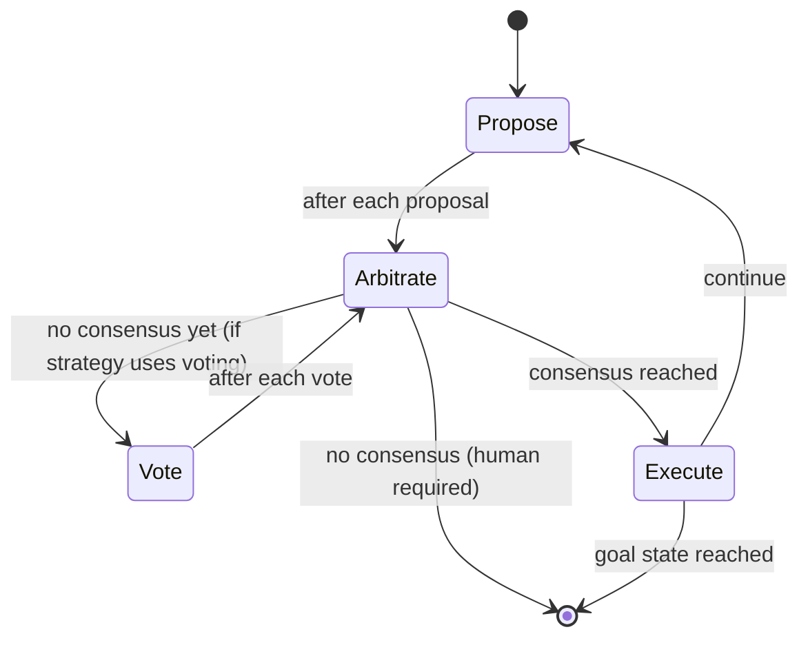

# Decision Cycle

When a session is not in its goal state, the system progresses through a repeating cycle until it reaches the goal.

## Asynchronous by Design

The decision cycle is **asynchronous**: proposals and votes arrive in an uncontrolled, unbound manner. There is no defined order or timing—specialists submit their contributions whenever they're ready. The cycle concludes once consensus is reached, but proposals and votes may continue to arrive afterward (they are simply ignored for the completed cycle).

This design accommodates:
- **Heterogeneous response times**: Fast AI models respond in seconds; humans may take hours or days
- **Distributed specialists**: Webhook-based specialists may be across networks with variable latency
- **Late arrivals**: A slow specialist's contribution doesn't block progress if consensus forms first

## The Phases

### 1. Propose

Proposals arrive asynchronously from registered proposers. Each proposer analyzes the current state and available transitions, then submits a proposal. Each proposal includes:
- The proposed transition name
- The target state
- Reasoning for the proposal

Multiple proposers may submit different proposals for the same decision point. This is expected—for strategies that use voting, the voting phase resolves which proposal wins.

### 2. Vote *(strategy-dependent)*

Some [arbitration strategies](./consensus-strategies.md) require voting (e.g., `aheadByK`, `pairwiseConsensus`). Others (e.g., `firstProposal`, `mostSimilar`) evaluate proposals directly and skip the voting phase entirely.

When voting is used, voters compare proposals pairwise. Each voter expresses a preference:

| Vote | Meaning |
|------|---------|
| **A** | Prefer proposal A |
| **B** | Prefer proposal B |
| **BOTH** | Both are acceptable |
| **NEITHER** | Both are unacceptable |

Votes arrive asynchronously. The system uses Swiss tournament pairing to efficiently compare proposals with similar support levels first.

### 3. Arbitrate

After each proposal (and each vote, for strategies that use voting), consensus is evaluated. Consensus evaluation runs continuously as new contributions arrive. What the arbiter checks depends on the [consensus strategy](./consensus-strategies.md):

- **`firstProposal`**: Declares consensus on the first proposal received—no voting needed
- **`mostSimilar`**: Compares proposals to human gold examples via semantic similarity—no voting needed
- **`aheadByK`**: Requires the leading proposal to be ahead by k votes
- **`pairwiseConsensus`**: Requires a proposal to win a threshold percentage of pairwise matchups

If consensus is reached, the transition executes automatically.

### 4. Execute

If consensus is reached, the winning proposal's transition executes:
- The session's current state updates to the target state
- All proposals and votes for that round are cleared
- A new round begins

The cycle repeats until the session reaches its **goal state** (the rest state).

## When Consensus Fails

When specialists cannot reach consensus, the system surfaces the decision to a human. See [Arbitration — When Consensus Fails](./arbitration.md#when-consensus-fails) for details.

## Related Concepts

- [Arbitration](./arbitration.md): How consensus is evaluated
- [Specialists](./specialists.md): The actors that propose and vote
- [Human Primacy](./human-primacy.md): Why humans override when consensus fails
