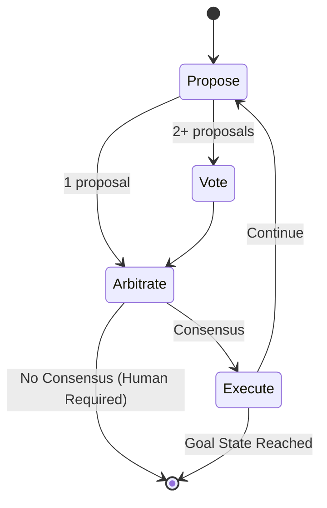

# Decision Cycle

When a session is not in its goal state, the system progresses through a repeating cycle until it reaches the goal.

## Asynchronous by Design

The decision cycle is **asynchronous**: proposals and votes arrive in an uncontrolled, unbound manner. There is no defined order or timing—specialists submit their contributions whenever they're ready. The cycle concludes once consensus is reached, but proposals and votes may continue to arrive afterward (they are simply ignored for the completed cycle).

This design accommodates:
- **Heterogeneous response times**: Fast AI models respond in seconds; humans may take hours or days
- **Distributed specialists**: Webhook-based specialists may be across networks with variable latency
- **Late arrivals**: A slow specialist's contribution doesn't block progress if consensus forms first

## The Four Phases

### 1. Propose

Proposals arrive asynchronously from registered proposers. Each proposer analyzes the current state and available transitions, then submits a proposal. Each proposal includes:
- The proposed transition name
- The target state
- Reasoning for the proposal

Multiple proposers may submit different proposals for the same decision point. This is expected—the voting phase resolves which proposal wins.

### 2. Vote

With multiple proposals, voters compare them pairwise. Each voter expresses a preference:

| Vote | Meaning |
|------|---------|
| **A** | Prefer proposal A |
| **B** | Prefer proposal B |
| **BOTH** | Both are acceptable |
| **NEITHER** | Both are unacceptable |

Votes arrive asynchronously. The system uses Swiss tournament pairing to efficiently compare proposals with similar support levels first.

### 3. Arbitrate

After each proposal and vote, consensus is evaluated. This is not a one-time evaluation—it runs continuously as new contributions arrive. The built-in arbiter checks:

- Do any proposals exist?
- Does the leading proposal have sufficient support (ahead by k votes)?

If consensus is reached, the transition executes automatically.

**Note on single proposals:** A single proposal can achieve consensus with just one supporting vote. Votes are still required—a proposal without any votes has no demonstrated support.

### 4. Execute

If consensus is reached, the winning proposal's transition executes:
- The session's current state updates to the target state
- All proposals and votes for that round are cleared
- A new round begins

The cycle repeats until the session reaches its **goal state** (the rest state).

## When Consensus Fails

It is entirely possible—and expected in complex scenarios—that specialists will **not** reach consensus on their own. This is not a failure; it's a feature.

When voters are split or vote NEITHER, the system naturally surfaces the decision to a human. The inability to reach consensus indicates:

- The decision requires human judgment
- The specialists may need additional training or clearer instructions
- The problem space has genuine ambiguity that humans should resolve

This is how DIAL implements [Human Primacy](./human-primacy.md) in practice: humans don't need to monitor every decision, only the ones where AI specialists genuinely disagree.

## Related Concepts

- [Arbitration](./arbitration.md): How consensus is evaluated
- [Specialists](./specialists.md): The actors that propose and vote
- [Human Primacy](./human-primacy.md): Why humans override when consensus fails
