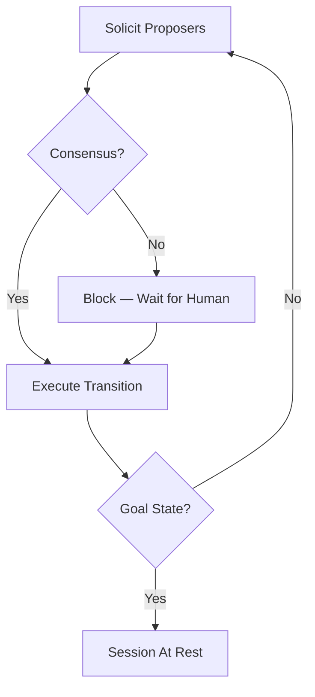

# Decision Cycle

When a session is not in its goal state, the **arbiter** drives a decision cycle that orchestrates specialists to find consensus on the next transition.

## Asynchronous by Design

The decision cycle is **asynchronous**: the arbiter solicits proposals from specialists at a steady pace, but contributions arrive on their own schedule. A webhook-based proposer might respond in milliseconds; a human might take hours. The arbiter doesn't wait for stragglers — it re-evaluates the **proposal count** after every arriving contribution and declares consensus the moment the ahead-by-k threshold is met.

This design accommodates:
- **Heterogeneous response times**: Fast AI models respond in seconds; humans may take hours or days
- **Distributed specialists**: Webhook-based specialists may be across networks with variable latency
- **Early resolution**: If all proposers choose the same transition, consensus may be reached before all proposers have even responded

## The Arbiter's Sequence

The arbiter solicits proposals and continuously evaluates consensus as contributions arrive.



### Phase 1: Solicit Proposers

The arbiter requests proposals from all enabled proposers. Each proposal includes:
- The **transition name** (which edge in the state machine)
- **Reasoning** (natural language explanation)
- **MetaJSON** (structured state description)

The arbiter **validates** each proposal as it arrives — invalid transitions are rejected. Valid proposals are **clustered by transition**: if two proposers both suggest "approve," their contributions support the same transition.

After each valid proposal arrives, the arbiter re-evaluates consensus. Each proposal endorses its transition, weighted by the proposer's alignment score. Consensus is reached when the alignment-weighted margin exceeds the threshold. The winning proposal is from the highest-alignment proposer within the winning transition group.

### Phase 2: Block for Human

If the arbiter has solicited all enabled proposers and consensus still hasn't been reached, the system **blocks**. This is not a failure; it means more input is needed. The task waits for a human to submit a proposal, which:

1. Immediately advances the session to the next state (human proposals always win)
2. Creates an **exemplar** (full context + human choice) for future learning
3. Updates alignment scores for all specialists who participated

## Consensus Evaluation

The arbiter counts proposals per transition. Each proposal is one endorsement. The first transition to be ahead of all other transitions by k proposals wins consensus.

```
count(transition) = number of proposals for that transition
```

Consensus is reached when the alignment-weighted margin exceeds the threshold:

```
margin = (leaderScore − runnerUpScore) / totalAlignment
consensus when: threshold < 1 AND margin >= threshold
```

Where the **consensus threshold** is a float (default 0.5), resolved by priority: state > machine > arbiter > 0.5.

See [Arbitration](./arbitration.md) for the full algorithm, including proposal clustering and self-healing.

## When Contributions Arrive Late

Because the cycle is asynchronous, contributions may arrive after consensus has been declared or after the round has ended. Late arrivals are ignored for the completed round but still provide useful data:

- **Alignment measurement**: The late specialist's choice can still be compared to the human-chosen outcome to update alignment scores
- **No harm**: A late proposal cannot retroactively change a completed transition

## The Continuous Nature

The arbiter doesn't process phases in strict sequence. It sends solicitations at a steady pace and continuously processes responses:

1. Sends `submitProposal` to Proposer A
2. Sends `submitProposal` to Proposer B
3. Proposer A responds → arbiter evaluates consensus
4. Proposer B responds → arbiter re-evaluates → consensus reached!

Meanwhile, humans may be proposing through the UI at any time. Their contributions flow into the same consensus evaluation. A human proposal always wins because it counts as a proposal with human authority.

## Related Concepts

- [Arbitration](./arbitration.md): The consensus algorithm and self-healing
- [Specialists](./specialists.md): The actors that propose transitions
- [Human Primacy](./human-primacy.md): Why humans override when consensus fails
