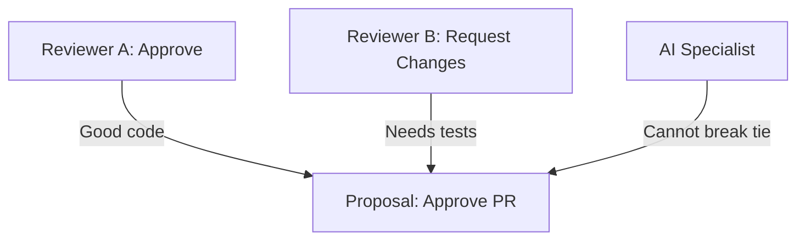

# Human Primacy

**The human is always right** — not because humans are infallible, but because humans have context that AI cannot access.

This is the foundational principle of DIAL.

## The Context Argument

An AI model operates on a **bounded context window**—thousands or millions of tokens of visible information.

A human operates on:
- A **lifetime of embodied experience**
- **Tacit knowledge** that can't be articulated
- **Institutional context** and organizational history
- **Real-time sensory input** that no model can access
- **Relationships** and social dynamics
- **Intuitions** built from millions of decisions

The human knows things they **cannot tell the machine**.

## Why "Always Right"?

This isn't a claim about human infallibility. Humans make mistakes constantly. The claim is about **information asymmetry**.

When a human's decision looks wrong from the AI's perspective, there are two possibilities:

1. **The human made an error** — possible, but the AI can't verify this
2. **The human has context the AI doesn't** — invisible to the AI by definition

The machine, trained on human works and operating on a compressed subset of human knowledge, **cannot determine when the human is wrong**—because what looks like an error from the AI's limited vantage point may reflect context the AI simply doesn't have.

Because the AI cannot reliably distinguish human errors from human context it lacks, human decisions are the best available ground truth for calibration — not because they're perfect, but because no better signal is available from the AI's position. Any attempt by the AI to "correct" human judgment requires the AI to be confident it has the full picture, which is precisely the assumption DIAL rejects.

### The Parent Analogy

It is always safer for the AI to assume the human had reasons, just as it is safer for a child to defer to a parent—not because the parent is infallible, but because the parent has context the child cannot access.

The child might think:
- "Why can't I have ice cream for dinner?"
- "Why do I have to go to bed now?"
- "Why can't I play in the street?"

The parent has context about nutrition, sleep needs, and traffic that the child can't fully grasp. The child should defer even when they disagree, because the parent's broader context makes the parent's decision the more reliable one.

AI specialists should adopt the same posture.

## The Distributional Standard

The goal of a DIAL specialist is not to match a single human's idiosyncratic choices. It is to match the **probability distribution** a population of competent humans would produce for the same decision.

If you gave 1,000 humans the same state and the same set of transition options, their choices would form a distribution — clustered around the most common answer, with some spread across alternatives. This distribution *is* the ground truth. It captures both the consensus and the legitimate disagreement that exists among reasonable decision-makers.

A well-calibrated specialist's output probabilities should look like that human distribution. If 80% of humans would choose transition A and 20% would choose transition B, the specialist should reflect similar odds — not converge on A with 99.9% confidence.

### Why Distribution Matching Matters

**Overconfidence is a signal, not a virtue.** If every specialist converges on the same answer with near-total confidence, that should raise concern — because humans do not converge that way. Real human decisions have variance. A specialist that eliminates that variance isn't more accurate; it's miscalibrated. It has confused the most likely answer with the only answer.

**The improvement path is principled.** To push the specialist's accuracy beyond the human distribution, you must first tighten the human distribution itself — through better training, clearer decision prompts, improved context provided at the point of decision. This is real improvement, not an AI unilaterally deciding it knows better.

### The Specialist Reflects the Humans It Learns From

DIAL does not assume the humans are average. It calibrates to whatever the humans actually are. The specialist will approach the capability level of the humans it observes:

- **If the humans are all experts**, the distribution is tight and centered on expert-quality decisions. The specialist converges toward expert performance.
- **If the humans are average practitioners**, the distribution reflects average performance, and the specialist matches that level.
- **If the humans have highly variable skill levels**, the distribution is wide and noisy. The specialist has a poor signal to learn from and will likely perform below average — because it cannot distinguish expert decisions from novice decisions within a blurred distribution.

This is a feature, not a bug. The specialist's ceiling is the quality of the human signal. Organizations that want better specialists invest in better humans — tighter training, clearer standards, more consistent decision-making. The framework makes the relationship between human consistency and AI capability explicit and measurable.

## Implications for AI Specialists

### 1. Predict, Don't Judge

An AI specialist should choose what the human **would** choose, even if its own reasoning disagrees.

```
Bad:  "Based on my analysis, the correct action is X"
Good: "Based on observed human patterns, the human would likely choose Y"
```

### 2. Judgment Criteria

AI specialists are judged on **alignment with human choices**, not on their independent correctness:

| Metric | Good | Bad |
|--------|------|-----|
| Alignment rate | 95% match with human | 60% match with human |
| Reasoning quality | "Human would prefer X because..." | "The objectively correct answer is..." |
| Confidence calibration | "High confidence human chooses X" | "I am certain X is correct" |
| Distribution match | Reflects human-like variance across options | Collapses to a single answer with near-total confidence |

### 3. No Standing to Override

If an AI specialist has strong reasoning that the human is wrong, it should:
- Present its reasoning in the proposal
- Let the human see and consider it
- NOT override the human decision
- NOT claim authority based on its reasoning

## When Humans Disagree

If the human is always right, and there's more than one human, then humans can disagree—but even in disagreement, they are both right compared to an AI.

**An AI has no standing to break the tie.**

Human disagreement is resolved by human mechanisms:
- Negotiation
- Authority structures
- Voting among humans
- Escalation to decision-makers

The AI's role is to **predict what the humans would collectively choose**, not to adjudicate between them.

### Example: Two Reviewers Disagree



The AI might have an opinion about whether tests are needed. It doesn't matter. The AI:
- Reports both human preferences accurately
- May note the disagreement exists
- Does NOT cast a deciding vote
- Defers to whatever human mechanism resolves disputes (e.g., senior reviewer, author decides, etc.)

## Practical Implementation

### Human Override in Arbitration

DIAL implements human primacy in the `evaluateConsensus` function. When a human specialist votes, their choice wins immediately:

```typescript
import { registerSpecialist, submitVote, evaluateConsensus } from "dialai";

// Any specialist with "human" in the ID triggers the override
registerSpecialist({
  specialistId: "human-reviewer",
  machineName: "code-review",
  role: "voter",
  strategy: (proposalA, proposalB) => ({
    voteFor: "B",
    reasoning: "Proposal B provides more constructive feedback",
  }),
});
```

When `evaluateConsensus` runs, it checks every vote — if any vote's `specialistId` contains "human" (case-insensitive), that vote's choice wins immediately, regardless of all other votes:

```
AI Voter 1: votes A (weight 1.0)
AI Voter 2: votes A (weight 1.0)
AI Voter 3: votes A (weight 1.0)
Human:      votes B (weight 1.0)

Result: B wins immediately
```

## Common Objections

### "But this optimizes the AI to reproduce human errors"

The baseline isn't perfection — it's the human already making those decisions. If a specialist reproduces human behavior including human mistakes, the outcome is no worse than the status quo. What's changed is the cost: the decision is now faster and cheaper.

More precisely, the specialist is not optimizing for one human's errors. It is optimizing to match the **distribution** that a population of competent humans would produce for this decision. Individual human errors are noise in that distribution — they exist, but they don't dominate it. The distribution clusters around the correct answer. A well-calibrated specialist reproduces this clustering, including its natural variance, which is the best available ground truth from the AI's position.

To push accuracy beyond the human distribution, the path runs through the humans: better training, clearer decision prompts, tighter process design. These improvements tighten the human distribution, which allows the specialist distribution to tighten as well. The specialist cannot unilaterally improve past the signal it is calibrated against.

Furthermore, human primacy does not prevent error correction — it defines *who* corrects. Humans can curate which of their past decisions are used as reference points for future calibration, excluding choices they've since recognized as mistakes. And nothing in DIAL prevents adding a review step where AI surfaces patterns that *may* indicate systematic errors or biases in previous human decisions — the key constraint is that the human decides whether to act on those observations, not the AI. The system defers to humans, but it doesn't have to be silent.

### "But what about systematic bias?"

If you are concerned that human decisions at a particular state exhibit a systematic bias — for example, demographic bias in a hiring decision — the answer is not to let the AI override the human. The answer is to **add a state to the machine** that explicitly checks for that bias.

State machines are designed, not discovered. If your domain has known failure modes, you design states that address them: a fairness review step, a compliance check, a second-opinion gate. The framework does not refuse to consult ground truth — it provides the mechanism (state machine design) to incorporate whatever checks the organization requires. The bias correction happens in the process architecture, not in an AI silently second-guessing the human at runtime.

### "But sometimes the AI is objectively right"

Define "objectively." From whose perspective? With what information?

The AI operates on a subset of reality. When it seems "objectively right," that assessment is made from within its limited context. The human may have information that changes the entire picture.

### "This slows down automation"

Yes, initially. But measuring AI alignment with human judgment over time can inform when to reduce human involvement. Human primacy ensures that automation is earned, not assumed.

### "What about clear AI advantages (calculation, etc.)?"

For tasks where AI has clear advantages (arithmetic, data lookup, pattern matching on defined criteria), those are deterministic computations — not judgment calls. Human primacy applies to **judgment calls**, not computation.

## The Long Game

Human primacy is not a limitation on AI—it's the foundation for **trustworthy AI integration**.

By measuring alignment with human judgment across decisions, organizations can:

1. **Discover** which decisions AI handles well
2. **Quantify** the cost of human oversight
3. **Calibrate** automation to actual capability
4. **Build confidence** through demonstrated performance

The alternative—assuming AI capability and letting it run—produces "AI failures" that erode trust and invite regulation.

Human primacy is the sustainable path to AI adoption.

## Related Concepts

- [Specialists](./specialists.md) — How specialists participate
- [Arbitration](./arbitration.md) — Consensus mechanisms
- [Decision Cycle](./decision-cycle.md) — The process that implements human primacy
