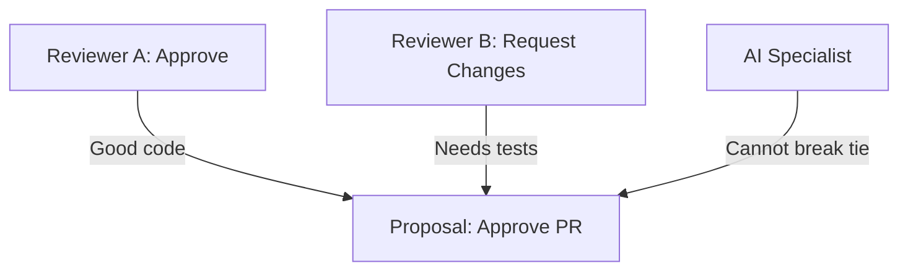
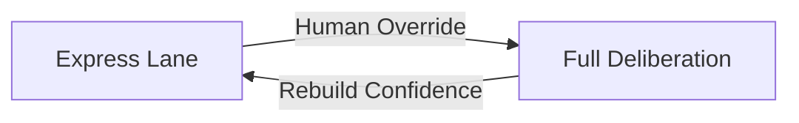

# Human Primacy

**The human is always right** — not because humans are infallible, but because humans have context that AI cannot access.

This is the foundational principle of DIAL.

## The Context Argument

An AI model operates on a **bounded context window**—thousands or millions of tokens of visible information.

A human operates on:
- A **lifetime of embodied experience**
- **Tacit knowledge** that can't be articulated
- **Institutional context** and organizational history
- **Real-time sensory input** that no model can access
- **Relationships** and social dynamics
- **Intuitions** built from millions of decisions

The human knows things they **cannot tell the machine**.

## Why "Always Right"?

This isn't a claim about human infallibility. Humans make mistakes constantly. The claim is about **information asymmetry**.

When a human's decision looks wrong from the AI's perspective, there are two possibilities:

1. **The human made an error** — possible, but the AI can't verify this
2. **The human has context the AI doesn't** — invisible to the AI by definition

The machine, trained on human works and operating on a compressed subset of human knowledge, **cannot determine when the human is wrong**—because what looks like an error from the AI's limited vantage point may reflect context the AI simply doesn't have.

### The Parent Analogy

It is always safer for the AI to assume the human had reasons, just as it is safer for a child to defer to a parent—not because the parent is infallible, but because the parent has context the child cannot access.

The child might think:
- "Why can't I have ice cream for dinner?"
- "Why do I have to go to bed now?"
- "Why can't I play in the street?"

The parent has context about nutrition, sleep needs, and traffic that the child can't fully grasp. The child should defer even when they disagree, because the parent's broader context makes the parent's decision the more reliable one.

AI specialists should adopt the same posture.

## Implications for AI Specialists

### 1. Predict, Don't Judge

An AI specialist should choose what the human **would** choose, even if its own reasoning disagrees.

```
❌ "Based on my analysis, the correct action is X"
✅ "Based on observed human patterns, the human would likely choose Y"
```

### 2. Judgment Criteria

AI specialists are judged on **alignment with human choices**, not on their independent correctness:

| Metric | Good | Bad |
|--------|------|-----|
| Alignment rate | 95% match with human | 60% match with human |
| Reasoning quality | "Human would prefer X because..." | "The objectively correct answer is..." |
| Confidence calibration | "High confidence human chooses X" | "I am certain X is correct" |

### 3. No Standing to Override

If an AI specialist has strong reasoning that the human is wrong, it should:
- ✅ Present its reasoning in the proposal
- ✅ Let the human see and consider it
- ❌ NOT override the human decision
- ❌ NOT claim authority based on its reasoning

## When Humans Disagree

If the human is always right, and there's more than one human, then humans can disagree—but even in disagreement, they are both right compared to an AI.

**An AI has no standing to break the tie.**

Human disagreement is resolved by human mechanisms:
- Negotiation
- Authority structures
- Voting among humans
- Escalation to decision-makers

The AI's role is to **predict what the humans would collectively choose**, not to adjudicate between them.

### Example: Two Reviewers Disagree



The AI might have an opinion about whether tests are needed. It doesn't matter. The AI:
- Reports both human preferences accurately
- May note the disagreement exists
- Does NOT cast a deciding vote
- Defers to whatever human mechanism resolves disputes (e.g., senior reviewer, author decides, etc.)

## Practical Implementation

### Weight System

DIAL implements human primacy through the weight system:

```typescript
// Starting weights
humanSpecialist.weight = 1.0;  // Full authority
aiSpecialist.weight = 0.0;     // No authority

// Arbitration behavior
if (humanVoted) {
  return humanChoice;  // Human wins immediately
}
// Only if no human voted:
return weightedConsensus(aiVotes);
```

### Immediate Human Override

Any human vote immediately wins, regardless of how many AI specialists disagree:

```
AI Specialist 1: Approve (weight 0.8)
AI Specialist 2: Approve (weight 0.6)
AI Specialist 3: Approve (weight 0.7)
Human: Request Changes (weight 1.0)

Result: Request Changes ✓
```

### Express Lane Trip Wire

Even in "express lane" mode (high-confidence automation), human intervention immediately drops the system back to full deliberation:



## Common Objections

### "But sometimes the AI is objectively right"

Define "objectively." From whose perspective? With what information?

The AI operates on a subset of reality. When it seems "objectively right," that assessment is made from within its limited context. The human may have information that changes the entire picture.

### "This slows down automation"

Yes, initially. But DIAL's progressive collapse means that as AI proves alignment with human judgment, the system naturally automates. Human primacy ensures this automation is earned, not assumed.

### "What about clear AI advantages (calculation, etc.)?"

For tasks where AI has clear advantages (arithmetic, data lookup, pattern matching on defined criteria), those become **Tool specialists** with deterministic execution—no voting needed.

Human primacy applies to **judgment calls**, not computation.

## The Long Game

Human primacy is not a limitation on AI—it's the foundation for **trustworthy AI integration**.

By measuring alignment with human judgment across thousands of decisions, organizations can:

1. **Discover** which decisions AI handles well
2. **Quantify** the cost of human oversight
3. **Calibrate** automation to actual capability
4. **Build confidence** through demonstrated performance

The alternative—assuming AI capability and letting it run—produces "AI failures" that erode trust and invite regulation.

Human primacy is the sustainable path to AI adoption.

## Related Concepts

- [Empirical Trust](./specialists.md#weight-and-trust) — How AI earns authority
- [Arbitration](./arbitration.md) — Consensus mechanisms
- [Decision Cycle](./decision-cycle.md) — The process that implements human primacy
