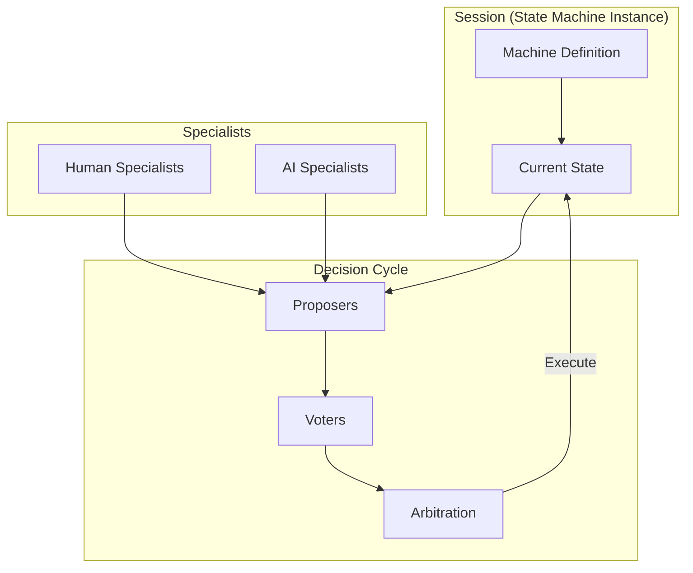
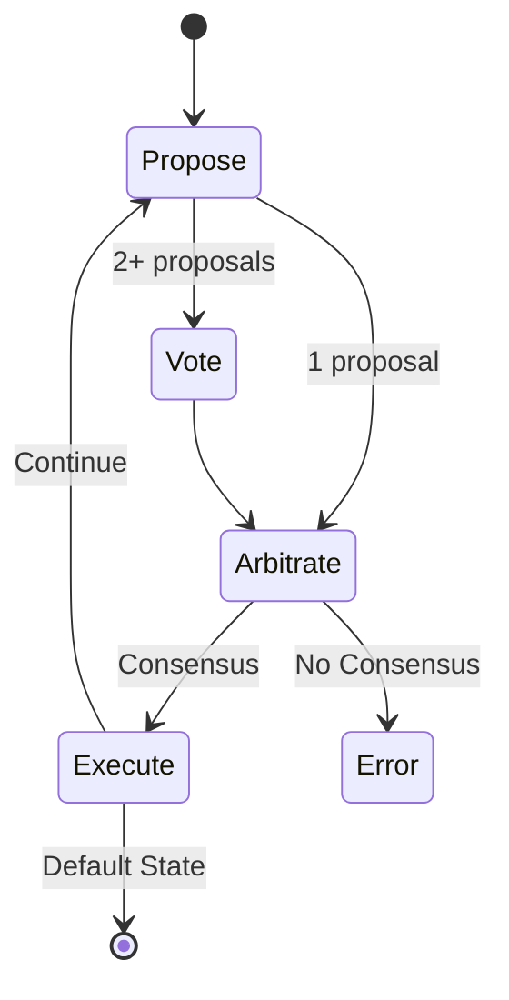

# Core Concepts

DIAL provides a structured approach to AI-human collaboration built around a few key abstractions.

## Overview

## The Big Picture

DIAL coordinates **specialists** (both AI and human) to navigate **state machines** through **decision cycles**.

### Sessions & State Machines

A **session** is an instance of a state machine. The machine definition specifies:
- A **`machineName`** identifying the type
- An **`initialState`** where sessions begin
- A **`defaultState`** (the goal state)
- A set of **states**, each with optional `prompt` and `transitions`

When a session is not in its default state, specialists work together to get it there.

[Learn more about Sessions →](./sessions.md)

### Specialists

**Specialists** are the pluggable actors that participate in sessions:

| Role | Description | Can be AI? | Can be Human? |
|------|-------------|------------|---------------|
| **Proposer** | Analyzes state, suggests transitions | Yes | Yes |
| **Voter** | Compares proposals, expresses preferences | Yes | Yes |
| **Arbiter** | Evaluates consensus (built-in) | No | No |

The Arbiter is always a fully deterministic, built-in component, never an AI model or a human. This is a deliberate safety constraint: the mechanism that decides whether consensus has been reached must be predictable and auditable.

Human specialists are identified by including "human" (case-insensitive) in their `specialistId`. Human votes override AI votes immediately.

[Learn more about Specialists →](./specialists.md)

### The Decision Cycle

When a session needs to progress, DIAL runs a repeating cycle:

1. **Propose**: Solicit proposals from registered proposers
2. **Vote**: If 2+ proposals, compare pairs via registered voters
3. **Arbitrate**: Evaluate consensus via voting
4. **Execute**: Apply the winning proposal's transition

[Learn more about the Decision Cycle →](./decision-cycle.md)

### Arbitration & Consensus

**Arbitration** is how DIAL decides when a proposal has won. The built-in strategy uses voting:

- **0 proposals**: No consensus
- **1 proposal**: Auto-consensus (single proposal wins)
- **2+ proposals**: Human votes win immediately; otherwise tally votes per proposal, leading proposal must be ahead by k=1 votes

[Learn more about Arbitration →](./arbitration.md)

### Human Primacy

The fundamental principle underlying DIAL:

> **The human is always right, not because humans are infallible, but because humans have context that AI cannot access.**

AI specialists are judged on their ability to predict what humans would choose. When a human specialist votes, that vote wins immediately regardless of AI votes.

[Learn more about Human Primacy →](./human-primacy.md)

## Quick Reference

### Vote Options

When comparing proposals A and B, specialists vote:
- **A**: Prefer proposal A
- **B**: Prefer proposal B
- **BOTH**: Both are acceptable (counts for both)
- **NEITHER**: Both are unacceptable (counts for neither)

## Next Steps

Dive deeper into each concept:

- [Sessions](./sessions.md): State machine instances
- [Specialists](./specialists.md): AI and human actors
- [Decision Cycle](./decision-cycle.md): The decision process
- [Arbitration](./arbitration.md): Consensus strategies
- [Human Primacy](./human-primacy.md): The foundational principle
- [Related Work](./related-work.md): How DIAL relates to other approaches
