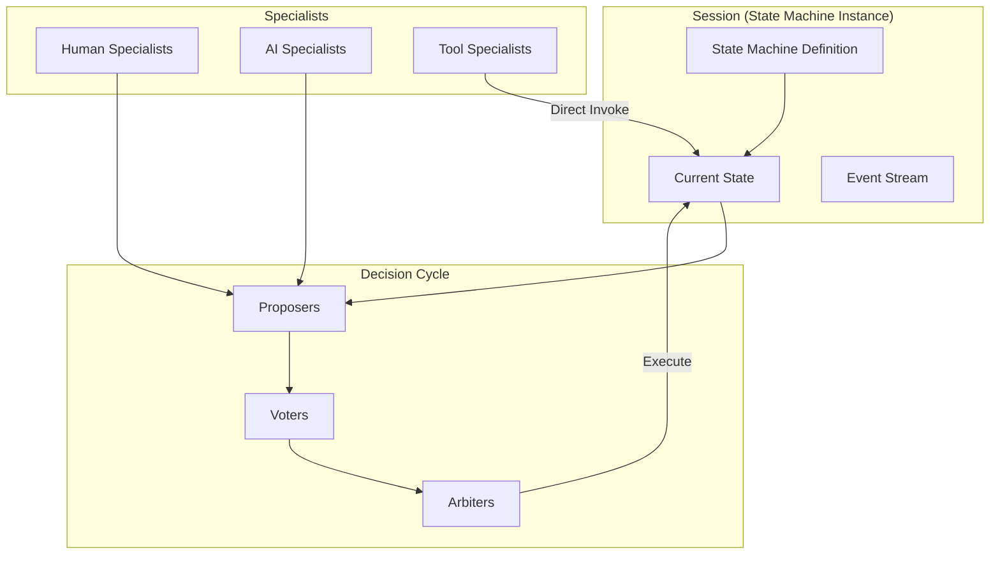
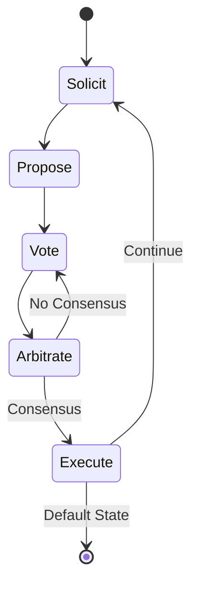

# Core Concepts

DIAL provides a structured approach to AI-human collaboration built around a few key abstractions. Understanding these concepts is essential to working with the framework effectively.

## Overview

## The Big Picture

At its core, DIAL coordinates **specialists** (both AI and human) to navigate **state machines** through **decision cycles**. Every action is recorded, every cost is measured, and trust is earned through demonstrated alignment.

### Sessions & State Machines

A **session** is an instance of a state machine. The machine defines:
- A **default state** (the goal state)
- Other **possible states**
- **Transitions** between states
- **Decision prompts** for each state

When a session is not in its default state, specialists work together to return it there.

[Learn more about Sessions →](./sessions.md)

### Specialists

**Specialists** are the pluggable actors that participate in sessions:

| Role | Description | Can be AI? | Can be Human? |
|------|-------------|------------|---------------|
| **Proposer** | Analyzes state, suggests transitions | ✅ | ✅ |
| **Voter** | Compares proposals, expresses preferences | ✅ | ✅ |
| **Arbiter** | Evaluates consensus | ✅ (deterministic) | ❌ |
| **Tool** | Performs direct transitions | ✅ (deterministic) | ❌ |

Human specialists are identified by including "human" in their `specialistId`. Human votes have weight 1.0 by default; AI votes start at 0.0.

[Learn more about Specialists →](./specialists.md)

### The Decision Cycle

When a session needs to progress, DIAL runs a five-phase cycle:

1. **Solicit** — Ask proposers what should happen next
2. **Propose** — Specialists submit recommendations with reasoning
3. **Vote** — Compare pairs of proposals (A vs B)
4. **Arbitrate** — Aggregate votes to find consensus
5. **Execute** — Run the winning proposal's transition

[Learn more about the Decision Cycle →](./decision-cycle.md)

### Arbitration & Consensus

**Arbitration** is how DIAL decides when a proposal has won. The default strategy uses weighted voting:

- Human votes win immediately (weight 1.0)
- AI votes are weighted by their earned trust
- A proposal must be ahead by `k` weighted votes to win

The **risk dial** is a per-state threshold that gates automation:
- **Below threshold**: Full deliberation (safer, slower)
- **Above threshold**: Express lane with a trusted "champion" (faster, cheaper)

[Learn more about Arbitration →](./arbitration.md)

### Human Primacy

The fundamental principle underlying DIAL:

> **The human is always right—not because humans are infallible, but because humans have context that AI cannot access.**

AI specialists are judged on their ability to predict what humans would choose. When humans disagree with each other, that disagreement is resolved by human mechanisms—AI has no standing to break the tie.

[Learn more about Human Primacy →](./human-primacy.md)

## Key Metrics

DIAL measures everything:

| Metric | What It Measures | Why It Matters |
|--------|------------------|----------------|
| **Cost per decision** | USD spent on LLM calls | Economics of delegation |
| **Latency** | Time from solicitation to execution | User experience |
| **Alignment rate** | % of AI predictions matching human choice | Trust calibration |
| **Weight** | Earned voting authority | Specialist performance |
| **Consensus rounds** | Iterations before agreement | Deliberation efficiency |

## Quick Reference

### Weights

| Specialist Type | Starting Weight | Can Increase? |
|----------------|-----------------|---------------|
| Human | 1.0 | No (always authoritative) |
| AI (LLM) | 0.0 | Yes (through alignment) |
| Tool | N/A | N/A (deterministic) |

### Vote Options

When comparing proposals A and B, specialists vote:
- **A** — Prefer proposal A
- **B** — Prefer proposal B  
- **BOTH** — Both are acceptable
- **NEITHER** — Both are unacceptable

### Execution Sources

When a transition executes, the source is recorded:
- **PROPOSAL** — From a winning proposal
- **MANUAL** — Direct human intervention
- **OVERRIDE** — Human overriding the system

## Next Steps

Dive deeper into each concept:

- [Sessions](./sessions.md) — State machine instances
- [Specialists](./specialists.md) — AI and human actors
- [Decision Cycle](./decision-cycle.md) — The five-phase process
- [Arbitration](./arbitration.md) — Consensus strategies
- [Human Primacy](./human-primacy.md) — The foundational principle
