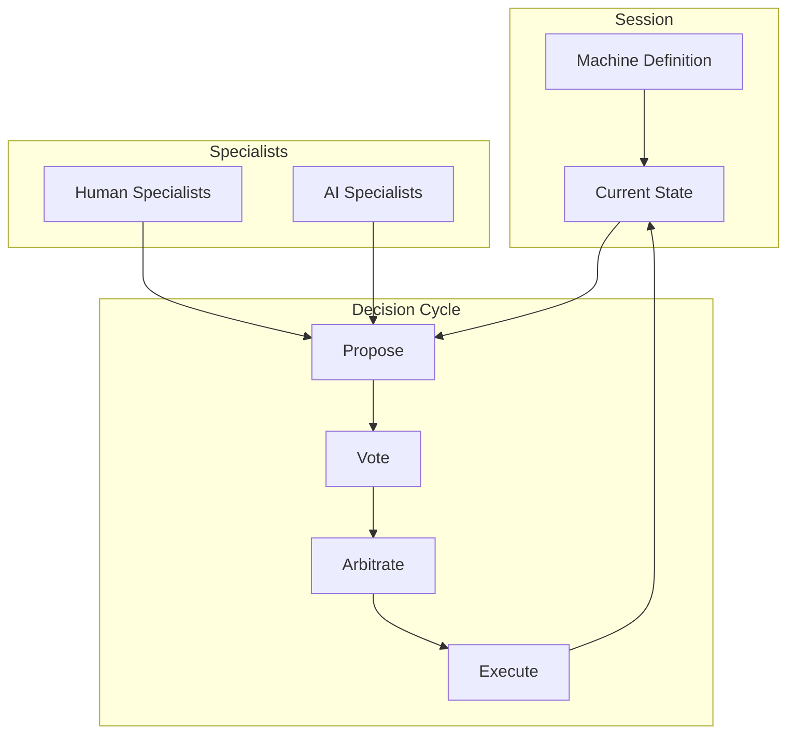

# Core Concepts

DIAL provides a structured approach to AI-human collaboration built around a few key abstractions. This section explains the conceptual foundations—what DIAL is and why it works the way it does.

## The Big Picture

DIAL coordinates **specialists** (both AI and human) to navigate **state machines** through **decision cycles**.

```mermaid
graph TB
    subgraph "Session"
        SM[Machine Definition]
        CS[Current State]
    end

    subgraph "Specialists"
        H[Human Specialists]
        AI[AI Specialists]
    end

    subgraph "Decision Cycle"
        P[Propose]
        V[Vote]
        A[Arbitrate]
        E[Execute]
    end

    SM --> CS
    CS --> P
    H --> P
    AI --> P
    P --> V
    V --> A
    A --> E
    E --> CS
```

### Sessions

A **session** is an instance of a state machine. It starts in an initial state and progresses toward a default (completion) state through decision cycles.

[Learn more about Sessions →](./sessions.md)

### Specialists

**Specialists** are the pluggable actors that participate in sessions:

| Role | Description | Can be AI? | Can be Human? |
|------|-------------|------------|---------------|
| **Proposer** | Analyzes state, suggests transitions | Yes | Yes |
| **Voter** | Compares proposals, expresses preferences | Yes | Yes |
| **Arbiter** | Evaluates consensus (built-in) | No | No |

The Arbiter is always a fully deterministic, built-in component—never an AI model or a human. This is a deliberate safety constraint: the mechanism that decides whether consensus has been reached must be predictable and auditable.

[Learn more about Specialists →](./specialists.md)

### The Decision Cycle

When a session needs to progress, DIAL runs a repeating cycle:

1. **Propose**: Specialists suggest transitions
2. **Vote**: Voters compare and evaluate proposals
3. **Arbitrate**: Consensus is evaluated
4. **Execute**: The winning transition advances the session

[Learn more about the Decision Cycle →](./decision-cycle.md)

### Arbitration

**Arbitration** is how DIAL decides when a proposal has won. The built-in strategy uses ahead-by-k voting:

- **0 proposals**: No consensus
- **1+ proposals**: The leading proposal must be ahead by k votes

[Learn more about Arbitration →](./arbitration.md)

### Human Primacy

The fundamental principle underlying DIAL:

> **The human is always right, not because humans are infallible, but because humans have context that AI cannot access.**

AI specialists are judged on their ability to predict what humans would choose. When consensus cannot be reached, only a human can force a decision.

[Learn more about Human Primacy →](./human-primacy.md)

## Quick Reference

### Vote Options

When comparing proposals A and B, specialists vote:

| Vote | Meaning |
|------|---------|
| **A** | Prefer proposal A |
| **B** | Prefer proposal B |
| **BOTH** | Both are acceptable |
| **NEITHER** | Neither is acceptable |

## Concepts in This Section

- [Sessions](./sessions.md): State machine instances
- [Specialists](./specialists.md): AI and human actors
- [Decision Cycle](./decision-cycle.md): The Propose → Vote → Arbitrate → Execute process
- [Arbitration](./arbitration.md): The arbiter's role in the decision cycle
- [Consensus Strategies](./consensus-strategies.md): Built-in strategies for determining consensus
- [Human Primacy](./human-primacy.md): The foundational principle
- [Alignment vs. Voting](./alignment-vs-voting.md): When to use direct alignment measurement vs. voting
- [Related Work](./related-work.md): How DIAL relates to other approaches
