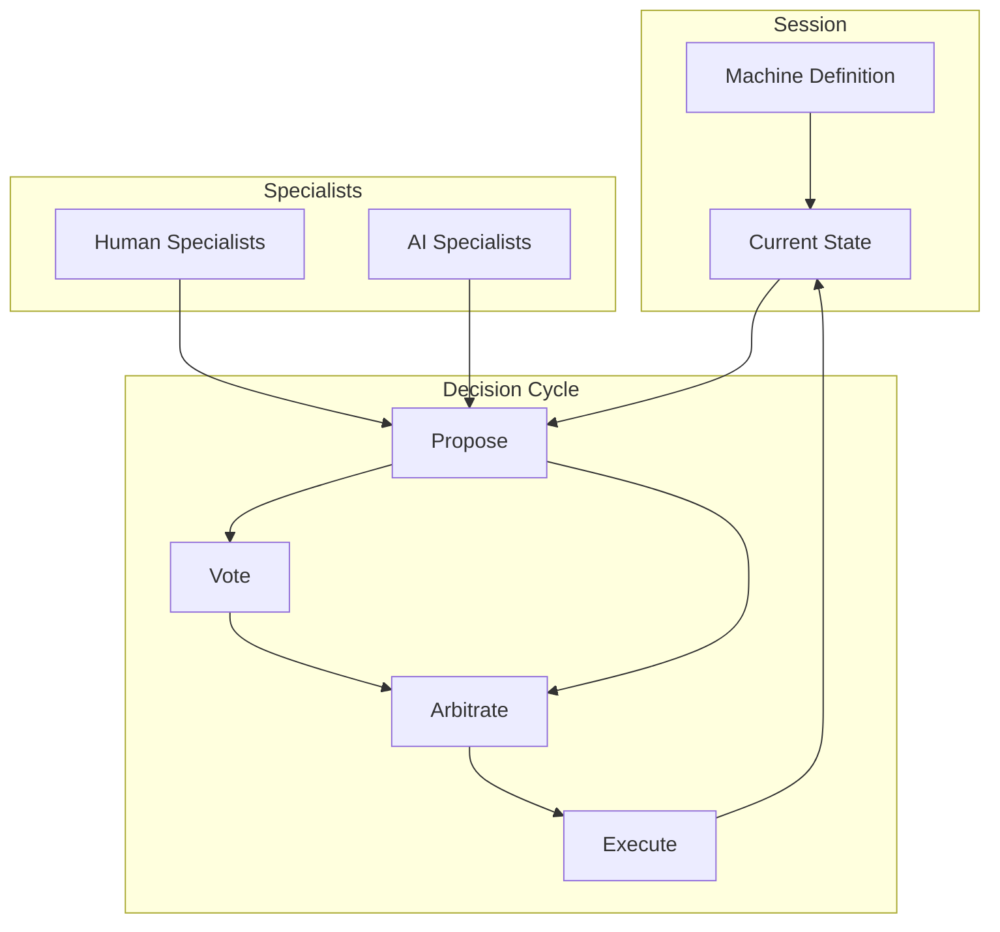

# Core Concepts

DIAL provides a structured approach to AI-human collaboration built around a few key abstractions. This section explains the conceptual foundations—what DIAL is and why it works the way it does.

## The Big Picture

DIAL orchestrates **specialists** (both AI and human) that compete and collaborate to navigate **state machines** through **decision cycles**.

### Task Specialists, Not Agents

DIAL does not guide a single agent toward completing a task. It simultaneously solicits proposals from an arbitrary number of models, prompts, and strategies — all competing at the same decision point, at the same time. Each registered proposer independently analyzes the current state and suggests a transition. When the arbitration strategy calls for it, a separate set of specialists evaluates those proposals through voting. The arbiter then determines consensus.

This is mass simultaneous solicitation, not sequential A/B testing. Every specialist registered for a machine participates in every decision cycle. The machine definition holds the full field of possible specialists in abstraction — any model, API, webhook, or local function can fill a role, and the set can change between cycles. DIAL materializes the field into a single concrete transition through the consensus mechanism.

A DIAL "specialist" is scoped to a specific role in a specific decision. A proposer suggests the best transition; a voter evaluates which proposal is strongest. The orchestration layer (the state machine and decision cycle) handles sequencing. Specialists are interchangeable and compete on the quality of their contributions, measured against human ground truth.

[Learn more about Specialists →](./specialists.md)

```mermaid
graph TB
    subgraph "Session"
        SM[Machine Definition]
        CS[Current State]
    end

    subgraph "Specialists"
        H[Human Specialists]
        AI[AI Specialists]
    end

    subgraph "Decision Cycle"
        P[Propose]
        V[Vote]
        A[Arbitrate]
        E[Execute]
    end

    SM --> CS
    CS --> P
    H --> P
    AI --> P
    P --> V
    P --> A
    V --> A
    A --> E
    E --> CS
```

### Sessions

A **session** is an instance of a state machine. It starts in an initial state and progresses toward a default (completion) state through decision cycles.

[Learn more about Sessions →](./sessions.md)

### Specialists

**Specialists** are the pluggable actors that participate in sessions. They fill three roles: **Proposers** suggest transitions, **Voters** compare proposals, and **Arbiters** evaluate consensus. Both proposers and voters can be AI or human; arbiters are always built-in deterministic components.

[Learn more about Specialists →](./specialists.md)

### The Decision Cycle

When a session needs to progress, DIAL runs a repeating cycle:

1. **Propose**: Specialists suggest transitions
2. **Vote** *(if required by strategy)*: Voters compare and evaluate proposals
3. **Arbitrate**: Consensus is evaluated
4. **Execute**: The winning transition advances the session

Whether voting occurs depends on the [arbitration strategy](./consensus-strategies.md). Some strategies (like `aheadByK` and `pairwiseConsensus`) require votes; others (like `firstProposal` and `mostSimilar`) determine consensus directly from proposals.

[Learn more about the Decision Cycle →](./decision-cycle.md)

### Arbitration

**Arbitration** is how DIAL decides when a proposal has won. DIAL ships with multiple [consensus strategies](./consensus-strategies.md)—some use voting (e.g., `aheadByK`), while others evaluate proposals directly (e.g., `mostSimilar`).

[Learn more about Arbitration →](./arbitration.md)

### Human Primacy

The fundamental principle underlying DIAL:

> **Humans have context that AI cannot access.** AI specialists are judged on their ability to predict what humans would choose. When consensus cannot be reached, only a human can force a decision.

[Learn more about Human Primacy →](./human-primacy.md)

## Quick Reference

### Vote Options

For strategies that use voting, when comparing proposals A and B, specialists vote:

| Vote | Meaning |
|------|---------|
| **A** | Prefer proposal A |
| **B** | Prefer proposal B |
| **BOTH** | Both are acceptable |
| **NEITHER** | Neither is acceptable |

## Concepts in This Section

- [Sessions](./sessions.md): State machine instances
- [Specialists](./specialists.md): AI and human actors
- [Decision Cycle](./decision-cycle.md): The Propose → (Vote) → Arbitrate → Execute process
- [Arbitration](./arbitration.md): The arbiter's role in the decision cycle
- [Consensus Strategies](./consensus-strategies.md): Built-in strategies for determining consensus
- [Human Primacy](./human-primacy.md): The foundational principle
- [Alignment vs. Voting](./alignment-vs-voting.md): When to use direct alignment measurement vs. voting
- [Related Work](./related-work.md): How DIAL relates to other approaches
