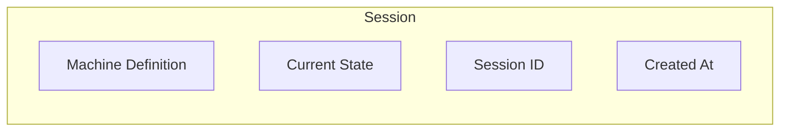

# Sessions

A **session** is an instance of a state machine that specialists navigate through decision cycles.

## What Is a Session?

A session has:

- A **machine definition**: the blueprint defining possible states and transitions
- A **current state**: where the session is right now
- A **session ID**: a unique UUID generated at creation
- A **creation timestamp**: when the session was started



## Session Lifecycle

### 1. Creation

A session starts with the `createSession` function:

```typescript
import { createSession } from "dialai";
import type { MachineDefinition } from "dialai";

const machine: MachineDefinition = {
  machineName: "document-review",
  initialState: "pending",
  defaultState: "approved",
  states: {
    pending: {
      prompt: "Review the document and decide: approve or request changes.",
      transitions: {
        approve: "approved",
        request_changes: "needs_revision",
      },
    },
    needs_revision: {
      prompt: "Review the revised document. Has the author addressed the feedback?",
      transitions: {
        approve: "approved",
        request_more_changes: "needs_revision",
      },
    },
    approved: {},
  },
};

const session = createSession(machine);
// session.sessionId     → "a1b2c3d4-..."
// session.currentState  → "pending"
// session.createdAt     → Date
```

The session is created in its `initialState`.

### 2. Progression

When a session is **not in its default state**, the decision cycle activates:

1. Specialists propose transitions
2. Proposals are compared through voting (if 2+)
3. Consensus is evaluated
4. The winning transition executes

### 3. Completion

A session is "complete" when it reaches its **`defaultState`**.

## Machine Definition

Each session has a `MachineDefinition` that defines its structure:

```typescript
interface MachineDefinition {
  machineName: string;
  initialState: string;
  defaultState: string;
  states: Record<string, {
    prompt?: string;
    transitions?: Record<string, string>;
  }>;
}
```

### Fields

| Field | Description |
|-------|-------------|
| `machineName` | Identifies the type of session (e.g., `"document-review"`) |
| `initialState` | The state a session starts in |
| `defaultState` | The goal state; session is complete when it reaches this |
| `states` | A record of state names to their configuration |

### State Configuration

Each state can have:
- **`prompt`**: A description of the decision to be made in this state. Given to specialists to guide their proposals.
- **`transitions`**: A map of transition names to target states. If omitted, the state is terminal (no outgoing transitions).

### Decision Prompts

Each state's `prompt` describes the decision to be made. This prompt is:
- Given to all specialists (AI and human)
- Specialist-agnostic (same instructions for everyone)
- The source of truth for how to decide

## Querying Sessions

```typescript
import { getSession, getSessions } from "dialai";

// Get a specific session by ID
const session = getSession("a1b2c3d4-...");

// Get all sessions
const allSessions = getSessions();
```

## Session Types

A **session type** identifies which kind of machine is being run:

```typescript
machineName: "document-review"
machineName: "code-review"
machineName: "support-ticket"
```

Different session types have:
- Different machine definitions
- Different registered specialists

## Best Practices

### 1. Design Clear Default States

The default state should represent "done" or "stable":
- `approved`, `completed`, `resolved`
- Not `processing`, `in_progress`, `waiting`

### 2. Use Descriptive Decision Prompts

Good prompts are specific and actionable:

```
"Review the code changes. Check for: 1) correctness, 2) test coverage,
 3) documentation. Approve if all criteria met, otherwise request changes."

Not: "Decide what to do next."
```

### 3. Name Transitions Clearly

Transition names should describe the action being taken:

```typescript
transitions: {
  approve: "approved",        // Clear action
  request_changes: "needs_revision",
  reject: "rejected",
}
```

## Next Steps

- [Specialists](./specialists.md): Learn about the actors that navigate sessions
- [Decision Cycle](./decision-cycle.md): Understand how decisions are made
