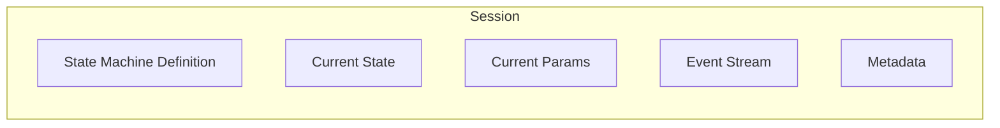

# Sessions

A **session** is an instance of a state machine that specialists navigate through decision cycles.

## What Is a Session?

Think of a session as a "live" workflow being processed. It has:

- A **state machine definition** — The blueprint defining possible states and transitions
- A **current state** — Where the session is right now
- **State parameters** — Data associated with the current state
- An **event stream** — Complete history of everything that happened
- **Metadata** — Custom data attached at creation



## Session Lifecycle

### 1. Creation

A session starts with the `start_session` command:

```typescript
// Start a new session
await startSession({
  sessionTypeName: "document-review",
  metadataJSONString: JSON.stringify({ 
    documentId: "doc-123",
    requestedBy: "user@example.com" 
  }),
  initialParamsJSONString: JSON.stringify({ 
    status: "pending" 
  })
});
```

The session is created in its initial state (often the default state).

### 2. Progression

When a session is **not in its default state**, the decision cycle activates:

1. Specialists propose transitions
2. Proposals are compared through voting
3. Consensus is evaluated
4. The winning transition executes

### 3. Completion

A session is "complete" when it returns to its **default state**. The default state represents the goal—the stable configuration where no further action is needed.

## State Machine Definition

Each session type has an associated state machine:

```typescript
// Conceptual structure
const documentReviewMachine = {
  id: "document-review",
  initial: "pending",
  states: {
    pending: {
      meta: {
        prompt: "Review the document and decide: approve, request changes, or reject."
      },
      on: {
        APPROVE: "approved",
        REQUEST_CHANGES: "needs_revision",
        REJECT: "rejected"
      }
    },
    needs_revision: {
      meta: {
        prompt: "Review the revised document. Has the author addressed the feedback?"
      },
      on: {
        APPROVE: "approved",
        REJECT: "rejected",
        REQUEST_MORE_CHANGES: "needs_revision"
      }
    },
    approved: {
      type: "final"
    },
    rejected: {
      type: "final"
    }
  }
};
```

### Decision Prompts

Each state has a **meta.prompt** that describes the decision to be made. This prompt is:
- Given to all specialists (AI and human)
- Specialist-agnostic (same instructions for everyone)
- The source of truth for how to decide

## Current State & Parameters

### State Name

The `currentStateName` identifies where the session is:

```typescript
session.currentStateName; // "needs_revision"
```

### State Parameters

The `currentParamsJSONString` holds state-specific data:

```typescript
JSON.parse(session.currentParamsJSONString);
// {
//   revisionNumber: 2,
//   lastFeedback: "Please add more examples",
//   previousReviewer: "specialist.human.jane"
// }
```

Parameters are **opaque to the DIAL framework**—it stores and routes them but doesn't interpret their contents.

## Event Stream

Every action in a session is recorded as an event:

```typescript
// Types of events
session_started
proposal_submitted
vote_submitted
proposal_solicited
vote_solicited
transition_executed
consensus_evaluated
```

The event stream provides:
- **Complete audit trail** — What happened and when
- **Replay capability** — Test new models against historical decisions
- **Context for specialists** — Full history available during decision-making

### Example Event Stream

```json
[
  { "type": "session_started", "timestamp": "2024-01-15T10:00:00Z", "state": "pending" },
  { "type": "proposal_solicited", "timestamp": "2024-01-15T10:00:01Z", "specialistId": "llm.gpt-4" },
  { "type": "proposal_submitted", "timestamp": "2024-01-15T10:00:02Z", "transition": "APPROVE" },
  { "type": "vote_solicited", "timestamp": "2024-01-15T10:00:03Z", "specialistId": "human.reviewer" },
  { "type": "vote_submitted", "timestamp": "2024-01-15T10:00:30Z", "voteFor": "A" },
  { "type": "transition_executed", "timestamp": "2024-01-15T10:00:31Z", "toState": "approved" }
]
```

## Session Metadata

Metadata is attached at session creation and stays constant:

```typescript
const metadata = {
  // Application-specific data
  documentId: "doc-123",
  priority: "high",
  deadline: "2024-01-20",
  
  // Tracking
  createdBy: "user@example.com",
  department: "engineering"
};
```

Metadata is **opaque**—DIAL stores it but the structure is defined by your application.

## Querying Sessions

Sessions can be queried to find work in progress:

```typescript
// Find sessions needing attention
const activeSessions = await getSessions({
  sessionTypeName: "document-review",
  currentStateName: "needs_revision"  // Not in default state
});

// Get a specific session
const session = await getSession({ sessionId: "abc-123" });
```

## Session Types

A **session type** identifies which state machine definition to use:

```typescript
sessionTypeName: "document-review"
sessionTypeName: "code-review"  
sessionTypeName: "support-ticket"
sessionTypeName: "order-fulfillment"
```

Different session types have:
- Different state machines
- Different registered specialists
- Different decision prompts

## Best Practices

### 1. Design Clear Default States

The default state should represent "done" or "stable":
- ✅ `approved`, `completed`, `resolved`
- ❌ `processing`, `in_progress`, `waiting`

### 2. Use Descriptive Decision Prompts

Good prompts are specific and actionable:

```
✅ "Review the code changes. Check for: 1) correctness, 2) test coverage, 
   3) documentation. Approve if all criteria met, otherwise request changes."

❌ "Decide what to do next."
```

### 3. Include Relevant Context in Parameters

State parameters should contain everything needed for the decision:

```typescript
// Good: All relevant context included
{
  documentContent: "...",
  previousFeedback: ["Add examples", "Fix typos"],
  revisionHistory: [...]
}

// Bad: Requires external lookups
{
  documentId: "doc-123"  // Specialists can't access the document!
}
```

### 4. Keep Events Immutable

The event stream is append-only. Never:
- Delete events
- Modify past events
- Backdate events

## Next Steps

- [Specialists](./specialists.md) — Learn about the actors that navigate sessions
- [Decision Cycle](./decision-cycle.md) — Understand how decisions are made
