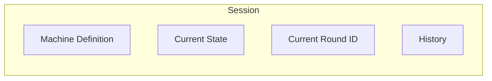

# Sessions

A **session** is an instance of a state machine that specialists navigate through decision cycles.

## What Is a Session?

A session represents a single execution of a state machine. It has:

- A **machine definition**: the blueprint defining possible states and transitions
- A **current state**: where the session is right now
- A **current round ID**: regenerated on each state transition to track the decision cycle
- A **session ID**: a unique identifier
- A **history**: record of all transitions that have occurred
- A **creation timestamp**: when the session was started

```mermaid
graph LR
    subgraph Session
        D[Machine Definition]
        C[Current State]
        R[Current Round ID]
        H[History]
    end
```

## Session Lifecycle

### 1. Creation

A session starts in its **initial state**—the starting point defined in the machine definition.

### 2. Progression

When a session is **not in its goal state**, the decision cycle activates:

1. Specialists propose transitions
2. Proposals are compared through voting (if 2+ exist)
3. Consensus is evaluated
4. The winning transition executes
5. The session moves to a new state

Each time a transition executes, a new round begins with a fresh round ID.

### 3. Completion

A session is "at rest" when it reaches its **goal state**—the rest state defined in the machine definition. In the goal state, no further decision cycles are needed until something moves the session elsewhere. Note that initialState and goalState can be the same for cyclical workflows.

## Machine Definition

Each session runs according to a **machine definition** that specifies:

| Field | Description |
|-------|-------------|
| **machineName** | Identifies the type of machine (e.g., "document-review") |
| **initialState** | The state where sessions start |
| **goalState** | The rest state where the session is headed; no action needed when reached |
| **states** | A record of state names to their configuration |

### State Configuration

Each state can have:

- **prompt**: A description of the decision to be made. This is given to all specialists and guides their proposals.
- **transitions**: A map of transition names to target states. If omitted, the state is terminal.

## Decision Prompts

Each state's `prompt` describes the decision to be made. Good prompts are:

- **Specific**: List the available choices and criteria
- **Actionable**: Tell the specialist what to evaluate
- **Consistent**: Same instructions for all specialists (AI and human)

Example of a good prompt:
> "Review the code changes. Check for: 1) correctness, 2) test coverage, 3) documentation. Approve if all criteria met, otherwise request changes."

Example of a poor prompt:
> "Decide what to do next."

## Machine Names

The **machine name** identifies which kind of machine a session is running. Different machines have:

- Different definitions (states, transitions, prompts)
- Different registered specialists

Examples: `"document-review"`, `"code-review"`, `"support-ticket"`

## Best Practices

### 1. Design Clear Goal States

The goal state should represent "at rest" or "stable":
- Good: `approved`, `completed`, `resolved`
- Avoid: `processing`, `in_progress`, `waiting`

### 2. Name Transitions Clearly

Transition names should describe the action being taken:
- Good: `approve`, `reject`, `request_changes`
- Avoid: `next`, `continue`, `option1`

### 3. Keep State Machines Focused

Each machine should model one type of decision process. If a workflow has distinct phases, consider whether they should be separate machines or separate states within one machine.

## Next Steps

- [Specialists](./specialists.md): Learn about the actors that navigate sessions
- [Decision Cycle](./decision-cycle.md): Understand how decisions are made
