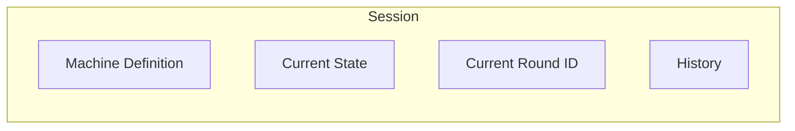

# Sessions

A **session** is an instance of a state machine that specialists navigate through decision cycles.

## What Is a Session?

A session represents a single execution of a state machine. It has:

- A **machine definition**: the blueprint defining possible states and transitions
- A **current state**: where the session is right now
- A **current round ID**: regenerated on each state transition to track the decision cycle
- A **session ID**: a unique identifier
- A **history**: record of all transitions that have occurred
- A **creation timestamp**: when the session was started

```mermaid
graph LR
    subgraph Session
        D[Machine Definition]
        C[Current State]
        R[Current Round ID]
        H[History]
    end
```

## Session Lifecycle

### 1. Creation

A session starts in its **initial state** — the starting point defined in the machine definition.

### 2. Progression

When a session is **not in its goal state**, the [arbiter](./arbitration.md) drives a decision cycle:

1. The arbiter solicits proposals from enabled proposers
2. The arbiter counts proposals per transition and checks [ahead-by-k consensus](./consensus-strategies.md#aheadbyk-default) after each arriving proposal
3. When consensus is reached (or a human submits a proposal, which always wins), the transition executes
4. The session moves to a new state and a new round begins

Each round produces alignment data: every specialist's contribution is compared against the winning transition, updating their alignment scores.

### 3. Completion

A session is "at rest" when it reaches its **goal state** — the rest state defined in the machine definition. In the goal state, no further decision cycles are needed until something moves the session elsewhere. Note that `initialState` and `goalState` can be the same for cyclical workflows.

## Machine Definition

Each session runs according to a **machine definition** that specifies:

| Field | Description |
|-------|-------------|
| **machineName** | Identifies the type of machine (e.g., "document-review") |
| **initialState** | The state where sessions start |
| **goalState** | The rest state where the session is headed |
| **states** | A record of state names to their configuration |

### State Configuration

Each state can have:

- **prompt**: A description of the decision to be made. This is given to all specialists and guides their proposals.
- **transitions**: A map of transition names to target states. If omitted, the state is terminal.
- **consensusThreshold**: The consensus threshold for this state (float, 0–1). Controls the alignment-weighted margin required for auto-approval. Higher = more deliberation required. If omitted, resolved by priority: machine > arbiter > 0.5.

### The Ahead-by-k Threshold

Each state has a **consensus threshold** (the ahead-by-k parameter) that controls how easily the arbiter can reach consensus:

| Value | Behavior |
|-------|----------|
| **0.3** | Low bar — a modest alignment-weighted lead is enough |
| **0.5** | Moderate lead required — standard decisions |
| **0.7** | Strong lead required — important decisions needing high confidence |
| **1.0** | Unanimity required — all proposals must agree |

You can set different thresholds for different states. A high-stakes "approve deployment" state might use `consensusThreshold: 1.0`, while a routine "categorize ticket" state might use `consensusThreshold: 0.3`.

## Decision Prompts

Each state's `prompt` describes the decision to be made. Good prompts are:

- **Specific**: List the available choices and criteria
- **Actionable**: Tell the specialist what to evaluate
- **Consistent**: Same instructions for all specialists (AI and human)

Example of a good prompt:
> "Review the code changes. Check for: 1) correctness, 2) test coverage, 3) documentation. Approve if all criteria met, otherwise request changes."

Example of a poor prompt:
> "Decide what to do next."

## Machine Names

The **machine name** identifies which kind of machine a session is running. Different machines have:

- Different definitions (states, transitions, prompts)
- Different registered specialists
- Different consensus thresholds

Examples: `"document-review"`, `"code-review"`, `"support-ticket"`

## Best Practices

### 1. Design Clear Goal States

The goal state should represent "at rest" or "stable":
- Good: `approved`, `completed`, `resolved`
- Avoid: `processing`, `in_progress`, `waiting`

### 2. Name Transitions Clearly

Transition names should describe the action being taken:
- Good: `approve`, `reject`, `request_changes`
- Avoid: `next`, `continue`, `option1`

Transition names are what specialists see as tool calls — clear names help LLMs make better decisions.

### 3. Keep State Machines Focused

Each machine should model one type of decision process. If a workflow has distinct phases, consider whether they should be separate machines or separate states within one machine.

### 4. Start with High Thresholds

Begin with a higher `consensusThreshold` value (e.g., 0.8 or 1.0). This requires a stronger alignment-weighted margin, increasing the likelihood of human participation and generating exemplars. Lower the threshold only after specialists demonstrate reliable human alignment.

### 5. Design for Task Decomposition

If a state's decisions are too complex for cheap models, consider splitting it into sequential steps. A simple two-state machine where each state has a narrow decision is easier for lightweight models to handle than a single state with a complex, multifaceted decision.

## Next Steps

- [Specialists](./specialists.md): Learn about the actors that navigate sessions
- [Decision Cycle](./decision-cycle.md): Understand how the arbiter drives decisions
- [Arbitration](./arbitration.md): The consensus score algorithm
