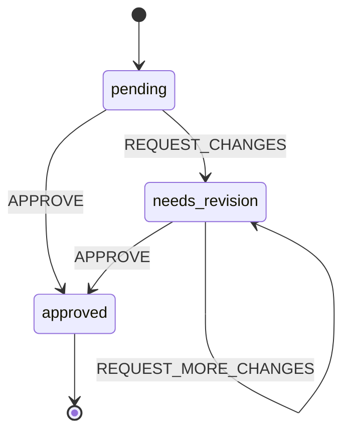

# Quick Start

Build your first DIAL state machine with AI and human specialists in under 10 minutes.

## What We'll Build

A simple **document review** workflow where:
- AI specialists propose whether to approve or request changes
- Humans can override any decision
- The system learns which AI predictions align with human judgment



## Step 1: Define the State Machine

Create your state machine definition:

```typescript
// src/machines/document-review.ts

export const documentReviewMachine = {
  id: 'document-review',
  initial: 'pending',
  context: {
    documentId: '',
    content: '',
    feedback: []
  },
  states: {
    pending: {
      meta: {
        prompt: `Review the document and decide:
        - APPROVE: If the document meets quality standards
        - REQUEST_CHANGES: If revisions are needed
        
        Consider: clarity, completeness, accuracy, and formatting.`
      },
      on: {
        APPROVE: 'approved',
        REQUEST_CHANGES: 'needs_revision'
      }
    },
    needs_revision: {
      meta: {
        prompt: `Review the revised document.
        
        Has the author addressed the previous feedback?
        - APPROVE: If feedback has been addressed
        - REQUEST_MORE_CHANGES: If more work is needed`
      },
      on: {
        APPROVE: 'approved',
        REQUEST_MORE_CHANGES: 'needs_revision'
      }
    },
    approved: {
      type: 'final',
      meta: {
        prompt: 'Document approved. No further action needed.'
      }
    }
  }
};
```

## Step 2: Create Specialist Strategies

### Proposer Strategy

The proposer analyzes the current state and suggests a transition:

```typescript
// src/strategies/document-review/proposer.ts

import type { ProposalDecisionInput } from 'dialai';

export async function propose(input: ProposalDecisionInput) {
  const { prompt, eventStream, modelId } = input;
  
  // Get the document content from the latest state params
  const latestTransition = eventStream
    .filter(e => e.type === 'transition_executed')
    .pop();
  
  const params = latestTransition?.toParamsJSONString 
    ? JSON.parse(latestTransition.toParamsJSONString)
    : {};
  
  // Call your LLM (simplified example)
  const response = await callLLM({
    model: modelId,
    messages: [
      {
        role: 'system',
        content: `You are a document reviewer. ${prompt}`
      },
      {
        role: 'user',
        content: `Review this document:\n\n${params.content || 'No content provided'}`
      }
    ]
  });
  
  // Parse the LLM's decision
  const decision = parseDecision(response);
  
  return {
    transitionName: decision.transition,
    toStateName: decision.targetState,
    toParamsJSONString: JSON.stringify({
      ...params,
      feedback: decision.feedback
    }),
    reasoning: decision.reasoning
  };
}

function parseDecision(response: string) {
  // Your logic to extract transition, target state, feedback, and reasoning
  if (response.toLowerCase().includes('approve')) {
    return {
      transition: 'APPROVE',
      targetState: 'approved',
      feedback: null,
      reasoning: 'Document meets quality standards'
    };
  }
  return {
    transition: 'REQUEST_CHANGES',
    targetState: 'needs_revision',
    feedback: extractFeedback(response),
    reasoning: 'Revisions needed'
  };
}
```

### Voter Strategy

The voter compares two proposals and expresses a preference:

```typescript
// src/strategies/document-review/voter.ts

import type { VoteDecisionInput } from 'dialai';

export async function vote(input: VoteDecisionInput) {
  const { prompt, proposalA, proposalB, modelId } = input;
  
  const response = await callLLM({
    model: modelId,
    messages: [
      {
        role: 'system',
        content: `You are comparing two document review decisions. ${prompt}`
      },
      {
        role: 'user',
        content: `
Proposal A: ${proposalA.transitionName}
Reasoning: ${proposalA.reasoning}

Proposal B: ${proposalB.transitionName}  
Reasoning: ${proposalB.reasoning}

Which proposal better serves the review goals?
Vote: A, B, BOTH (both acceptable), or NEITHER (both problematic)
        `
      }
    ]
  });
  
  return {
    voteFor: parseVote(response), // 'A' | 'B' | 'BOTH' | 'NEITHER'
    reasoning: response
  };
}
```

## Step 3: Register Specialists

Register your AI and human specialists:

```typescript
// src/index.ts

import { createDialClient } from 'dialai';
import { documentReviewMachine } from './machines/document-review';

async function setup() {
  const dial = createDialClient();
  
  // Register the state machine
  await dial.registerSessionType({
    sessionTypeName: 'document-review',
    machine: documentReviewMachine
  });
  
  // Register an AI proposer (starts with weight 0.0)
  await dial.registerSpecialist({
    specialistId: 'specialist.document-review.proposer.gpt-4',
    sessionTypeName: 'document-review',
    specialistRole: 'proposer',
    strategyFunctionKey: 'proposer',
    modelId: 'gpt-4',
    displayName: 'GPT-4 Reviewer',
    weight: 0.0,  // Must earn trust
    temperature: 0.2,
    maxTokens: 1000
  });
  
  // Register an AI voter (starts with weight 0.0)
  await dial.registerSpecialist({
    specialistId: 'specialist.document-review.voter.gpt-4',
    sessionTypeName: 'document-review',
    specialistRole: 'voter',
    strategyFunctionKey: 'voter',
    modelId: 'gpt-4',
    displayName: 'GPT-4 Voter',
    weight: 0.0,
    temperature: 0.1,
    maxTokens: 500
  });
  
  // Register a human specialist (weight 1.0 by default)
  await dial.registerSpecialist({
    specialistId: 'specialist.document-review.human.reviewer',
    sessionTypeName: 'document-review',
    specialistRole: 'proposer',  // Humans can also propose
    strategyFunctionKey: 'human', // Special handling
    modelId: 'human',
    displayName: 'Human Reviewer',
    weight: 1.0  // Full authority
  });
  
  console.log('Setup complete!');
}

setup().catch(console.error);
```

## Step 4: Run a Session

Start a session and watch the decision cycle:

```typescript
// src/run-review.ts

import { createDialClient } from 'dialai';

async function runReview() {
  const dial = createDialClient();
  
  // Start a new review session
  const session = await dial.startSession({
    sessionTypeName: 'document-review',
    initialParamsJSONString: JSON.stringify({
      documentId: 'doc-001',
      content: `
        # Project Proposal
        
        This proposal outlines a new feature for our application.
        
        ## Objectives
        - Improve user experience
        - Reduce load times by 50%
        
        ## Implementation
        We will refactor the database queries and add caching.
      `
    })
  });
  
  console.log('Session started:', session.sessionId);
  console.log('Current state:', session.currentStateName);
  
  // Solicit proposals from AI specialists
  await dial.solicitProposal({
    sessionId: session.sessionId,
    specialistId: 'specialist.document-review.proposer.gpt-4'
  });
  
  // Wait for proposal submission (in real app, this would be event-driven)
  await sleep(2000);
  
  // Check proposals
  const proposals = await dial.getProposals({ sessionId: session.sessionId });
  console.log('Proposals received:', proposals.length);
  
  // If we have multiple proposals, solicit votes
  if (proposals.length > 1) {
    await dial.solicitVote({
      sessionId: session.sessionId,
      specialistId: 'specialist.document-review.voter.gpt-4',
      proposalIdA: proposals[0].proposalId,
      proposalIdB: proposals[1].proposalId
    });
  }
  
  // Evaluate consensus
  const consensus = await dial.evaluateConsensus({
    sessionId: session.sessionId
  });
  
  console.log('Consensus reached:', consensus.consensusReached);
  
  if (consensus.consensusReached && consensus.winningProposalId) {
    const winner = proposals.find(p => p.proposalId === consensus.winningProposalId);
    
    // Execute the winning proposal
    await dial.executeTransition({
      sessionId: session.sessionId,
      transitionName: winner.transitionName,
      toStateName: winner.toStateName,
      toParamsJSONString: winner.toParamsJSONString,
      executionSource: 'PROPOSAL',
      proposalId: winner.proposalId
    });
    
    console.log('Transition executed!');
  }
  
  // Check final state
  const finalSession = await dial.getSession({ sessionId: session.sessionId });
  console.log('Final state:', finalSession.currentStateName);
}

runReview().catch(console.error);
```

## Step 5: Human Interaction

When a human needs to participate, they can:

### Submit a Proposal

```typescript
// Human decides to request changes
await dial.submitProposal({
  sessionId: session.sessionId,
  specialistId: 'specialist.document-review.human.reviewer',
  transitionName: 'REQUEST_CHANGES',
  toStateName: 'needs_revision',
  toParamsJSONString: JSON.stringify({
    feedback: ['Add more detail to the Implementation section']
  }),
  reasoning: 'The proposal lacks technical specifics'
});
```

### Cast a Vote

```typescript
// Human prefers proposal B over A
await dial.submitVote({
  sessionId: session.sessionId,
  specialistId: 'specialist.document-review.human.reviewer',
  proposalIdA: proposals[0].proposalId,
  proposalIdB: proposals[1].proposalId,
  voteFor: 'B',
  reasoning: 'Proposal B provides more constructive feedback'
});
```

**Human votes immediately win** — this is human primacy in action.

## What's Happening Under the Hood

1. **Session created** in `pending` state
2. **AI specialists solicited** to propose transitions
3. **Proposals compared** through pairwise voting
4. **Consensus evaluated** using weighted votes (AI weight 0.0, human weight 1.0)
5. **Transition executed** to move to next state
6. **Cycle repeats** until reaching `approved` (final state)

Over time, as you evaluate AI alignment with human choices, you can:
- Recalculate AI weights based on accuracy
- Enable express lane automation for high-confidence states
- Reduce human involvement where AI proves reliable

## Next Steps

You've built your first DIAL workflow! Now explore:

- **[State Machines](../guides/state-machines.md)** — Design more complex workflows
- **[Registering Specialists](../guides/registering-specialists.md)** — Add more AI models
- **[Implementing Strategies](../guides/implementing-strategies.md)** — Customize AI behavior
- **[Concepts](../concepts/intro.md)** — Deep dive into DIAL's architecture
