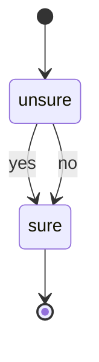

# Quick Start

Build your first DIAL state machine with specialists.

## What We'll Build

A trivially simple machine that asks "Is 2 > 1?" and transitions from `unsure` to `sure` regardless of the answer:



## Step 1: Define the Machine

Save this as `examples/simple-machine.json`:

```json
{
  "sessionTypeName": "is-two-greater",
  "initialState": "unsure",
  "defaultState": "sure",
  "states": {
    "unsure": {
      "prompt": "Is 2 > 1?",
      "transitions": { "yes": "sure", "no": "sure" }
    },
    "sure": {}
  }
}
```

- **`initialState`** — where the session starts (`unsure`)
- **`defaultState`** — the goal state where the machine comes to rest (`sure`)
- **`prompt`** — the question specialists answer when the session is in that state
- **`transitions`** — the available answers and what state each leads to

Both `yes` and `no` lead to `sure`, so the machine always resolves in one cycle.

Or define the same thing in TypeScript:

```typescript
import type { MachineDefinition } from "dialai";

const machine: MachineDefinition = {
  sessionTypeName: "is-two-greater",
  initialState: "unsure",
  defaultState: "sure",
  states: {
    unsure: {
      prompt: "Is 2 > 1?",
      transitions: { yes: "sure", no: "sure" },
    },
    sure: {},
  },
};
```

## Step 2: Run It

The quickest way to run a machine is with `runSession`, which registers a built-in proposer that picks the first available transition:

```typescript
import { runSession } from "dialai";

const session = runSession(machine);

console.log(session.currentState); // "sure"
```

That's it — one cycle, done.

## Step 3: Add a Human Specialist

The real point of DIAL is that humans can participate. Let's walk through the full API to see how a human votes `yes`.

```typescript
import {
  createSession,
  submitProposal,
  submitVote,
  evaluateConsensus,
  executeTransition,
} from "dialai";

// Create a session — starts in "unsure"
const session = createSession(machine);
console.log(session.currentState); // "unsure"

// Two specialists each submit a proposal
const proposalYes = submitProposal(
  session.sessionId,
  "ai-specialist",
  "yes",
  "sure",
  "2 is obviously greater than 1"
);

const proposalNo = submitProposal(
  session.sessionId,
  "contrarian-ai",
  "no",
  "sure",
  "I just like being difficult"
);

// A human votes for "yes" (proposal A)
submitVote(
  session.sessionId,
  "human-reviewer",
  proposalYes.proposalId,
  proposalNo.proposalId,
  "A",
  "Yes, 2 is greater than 1"
);

// Evaluate consensus — human votes win immediately
const consensus = evaluateConsensus(session.sessionId);
console.log(consensus.consensusReached); // true
console.log(consensus.reasoning);        // "Human voter override"

// Execute the winning transition, recording the arbiter's reasoning
executeTransition(session.sessionId, "yes", "sure", consensus.reasoning);
console.log(session.currentState); // "sure"
console.log(session.history);      // [{ fromState: "unsure", toState: "sure", reasoning: "Human voter override", ... }]
```

Because the specialist ID `"human-reviewer"` contains "human", `evaluateConsensus` gives their vote priority. This is **human primacy** — humans always get the final say.

## Step 4: Use the CLI

Run a machine definition from the command line:

```bash
node dist/dialai/cli.js examples/simple-machine.json
```

Output:
```
Session type:  is-two-greater
Initial state: unsure
Goal state:    sure
Final state:   sure
Session ID:    a1b2c3d4-...
```

## What's Happening Under the Hood

1. **Session created** in `initialState` (`unsure`)
2. **Proposers solicited** — each returns a proposed transition (`yes` or `no`)
3. **Votes solicited** (if 2+ proposals) — pairwise comparisons
4. **Consensus evaluated** — human votes override; otherwise weighted ahead-by-k
5. **Transition executed** — `currentState` moves to `sure`, proposals/votes cleared
6. **Cycle repeats** until `currentState === defaultState` (already there — done)

## Next Steps

- **[State Machines](../guides/state-machines.md)** — Design more complex workflows
- **[Registering Specialists](../guides/registering-specialists.md)** — Configure specialists with strategies
- **[Implementing Strategies](../guides/implementing-strategies.md)** — Customize strategy functions
- **[Concepts](../concepts/intro.md)** — Deep dive into DIAL's architecture
