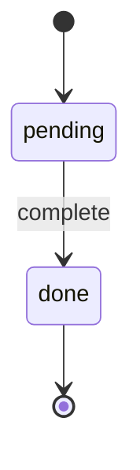

# Quick Start

Build your first DIAL state machine with specialists.

## What We'll Build

A trivially simple machine that asks "Should we complete this task?" and transitions from `pending` to `done`:



## Step 1: Define the Machine

Save this as `examples/simple-machine.json`:

```json
{
  "machineName": "simple-task",
  "initialState": "pending",
  "defaultState": "done",
  "states": {
    "pending": {
      "prompt": "Should we complete this task?",
      "transitions": { "complete": "done" }
    },
    "done": {}
  }
}
```

- **`initialState`**: where the session starts (`pending`)
- **`defaultState`**: the goal state where the machine comes to rest (`done`)
- **`prompt`**: the question specialists answer when the session is in that state
- **`transitions`**: the available answers and what state each leads to

Only one transition (`complete`) leads to `done`, so the machine always resolves in one cycle.

Or define the same thing in TypeScript:

```typescript
import type { MachineDefinition } from "dialai";

const machine: MachineDefinition = {
  machineName: "simple-task",
  initialState: "pending",
  defaultState: "done",
  states: {
    pending: {
      prompt: "Should we complete this task?",
      transitions: { complete: "done" },
    },
    done: {},
  },
};
```

## Step 2: Run It

The quickest way to run a machine is with `runSession`, which registers a built-in proposer that picks the first available transition:

```typescript
import { runSession } from "dialai";

const session = await runSession(machine);

console.log(session.currentState); // "done"
```

That's it. One cycle, done.

## Step 3: Add a Human Specialist

The real point of DIAL is that humans can participate. Let's walk through the full API to see how a human votes to complete the task.

```typescript
import {
  createSession,
  submitProposal,
  submitVote,
  evaluateConsensus,
  executeTransition,
} from "dialai";

// Create a session - starts in "pending"
const session = createSession(machine);
console.log(session.currentState); // "pending"

// Two specialists each submit a proposal
const proposalComplete = submitProposal(
  session.sessionId,
  "ai-specialist",
  "complete",
  "done",
  "The task is ready to complete"
);

const proposalWait = submitProposal(
  session.sessionId,
  "contrarian-ai",
  "complete",
  "done",
  "I agree, let's complete it"
);

// A human votes for proposal A (complete)
submitVote(
  session.sessionId,
  "human-reviewer",
  proposalComplete.proposalId,
  proposalWait.proposalId,
  "A",
  "Yes, let's complete this task"
);

// Evaluate consensus - human votes win immediately
const consensus = evaluateConsensus(session.sessionId);
console.log(consensus.consensusReached); // true
console.log(consensus.reasoning);        // "The human preferred: done"

// Execute the winning transition, recording the arbiter's reasoning
executeTransition(session.sessionId, "complete", "done", consensus.reasoning);
console.log(session.currentState); // "done"
console.log(session.history);      // [{ fromState: "pending", toState: "done", reasoning: "The human preferred: done", ... }]
```

Because the specialist ID `"human-reviewer"` contains "human", `evaluateConsensus` gives their vote priority. This is **human primacy**: humans always get the final say.

## Step 4: Use the CLI

Run a machine definition from the command line:

```bash
node dist/dialai/cli.js examples/simple-machine.json
```

Output:
```
Machine:       simple-task
Initial state: pending
Goal state:    done
Final state:   done
Session ID:    a1b2c3d4-...
```

## What's Happening Under the Hood

1. **Session created** in `initialState` (`pending`)
2. **Proposers solicited**: each returns a proposed transition (`complete`)
3. **Votes solicited** (if 2+ proposals): pairwise comparisons
4. **Consensus evaluated**: human votes override; otherwise ahead-by-k
5. **Transition executed**: `currentState` moves to `done`, proposals/votes cleared
6. **Cycle repeats** until `currentState === defaultState` (already there, done)

## Next Steps

- **[State Machines](../guides/state-machines.md)**: Design more complex workflows
- **[Registering Specialists](../guides/registering-specialists.md)**: Configure specialists with strategies
- **[Implementing Strategies](../guides/implementing-strategies.md)**: Customize strategy functions
- **[Concepts](../concepts/intro.md)**: Deep dive into DIAL's architecture
