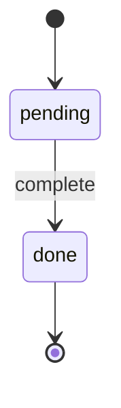

# Quick Start

Build your first DIAL state machine with specialists. This guide focuses on the code—for the concepts behind what you're building, see [Concepts](/docs/concepts/intro).

## What We'll Build

A trivially simple machine that asks "Should we complete this task?" and transitions from `pending` to `done`:


```mermaid
stateDiagram-v2
    [*] --> pending
    pending --> done: complete
    done --> [*]
```

## Step 1: Define the Machine

Save this as `examples/simple-machine.json`:

```json
{
  "machineName": "simple-task",
  "initialState": "pending",
  "goalState": "done",
  "states": {
    "pending": {
      "prompt": "Should we complete this task?",
      "transitions": { "complete": "done" }
    },
    "done": {}
  }
}
```

- **`initialState`**: where the session starts (`pending`)
- **`goalState`**: the rest state where the session is headed (`done`); no action needed when reached
- **`prompt`**: the question specialists answer when the session is in that state
- **`transitions`**: the available answers and what state each leads to

Only one transition (`complete`) leads to `done`, so the machine always resolves in one cycle.

Or define the same thing in TypeScript:

```typescript
import type { MachineDefinition } from "dialai";

const machine: MachineDefinition = {
  machineName: "simple-task",
  initialState: "pending",
  goalState: "done",
  states: {
    pending: {
      prompt: "Should we complete this task?",
      transitions: { complete: "done" },
    },
    done: {},
  },
};
```

## Step 2: Run It

The quickest way to run a machine is with `runSession`, which registers a built-in proposer that picks the first available transition:

```typescript
import { runSession } from "dialai";

const session = await runSession(machine);

console.log(session.currentState); // "done"
```

That's it. One cycle, done.

## Step 3: Add a Human Specialist

The real point of DIAL is that humans can participate. Let's walk through the full API to see how a human submits a proposal.

```typescript
import {
  createSession,
  submitProposal,
  submitArbitration,
} from "dialai";

// Create a session - starts in "pending"
const session = await createSession(machine);
console.log(session.currentState);   // "pending"
console.log(session.currentRoundId); // "e5f6g7h8-..."

// Two AI specialists each submit a proposal
const proposalA = await submitProposal({
  sessionId: session.sessionId,
  specialistId: "ai-specialist",
  roundId: session.currentRoundId,
  transitionName: "complete",
  reasoning: "The task is ready to complete",
  metaJson: { source: "automated-check" },
});

const proposalB = await submitProposal({
  sessionId: session.sessionId,
  specialistId: "contrarian-ai",
  roundId: session.currentRoundId,
  transitionName: "complete",
  reasoning: "I agree, let's complete it",
});

// Submit arbitration - checks for consensus (both propose "complete")
const result = await submitArbitration({ sessionId: session.sessionId, roundId: session.currentRoundId });
console.log(result.executed);    // true (both proposers agreed)
console.log(result.toState);     // "done"

console.log(session.currentState); // "done"
console.log(session.history);      // [{ transitionName: "complete", reasoning: "...", ... }]
```

**Human primacy** means that when AI cannot reach consensus, a human can force a decision by calling `submitArbitration` with an explicit transition. A human proposal always wins.

## Step 4: Use the CLI

Run a machine definition from the command line:

```bash
npx dialai examples/simple-machine.json
```

Output:
```
Machine:        simple-task
Initial state:  pending
Goal state:     done
Final state:    done
Session ID:     a1b2c3d4-...
```

## What's Happening Under the Hood

1. **Session created** in `initialState` (`pending`) with a fresh `currentRoundId`
2. **Proposers solicited**: each returns a proposed transition (`complete`)
3. **Arbitration submitted**: guards checked, ahead-by-k consensus evaluated
4. **Transition executed**: `currentState` moves to `done`, `currentRoundId` regenerated
5. **Cycle repeats** until `currentState === goalState` (already there, done)

## Next Steps

- **[State Machines](../guides/state-machines.md)**: Design more complex workflows
- **[Registering Specialists](../guides/registering-specialists.md)**: Configure specialists with strategies
- **[Implementing Strategies](../guides/implementing-strategies.md)**: Customize strategy functions
- **[Concepts](../concepts/intro.md)**: Deep dive into DIAL's architecture
