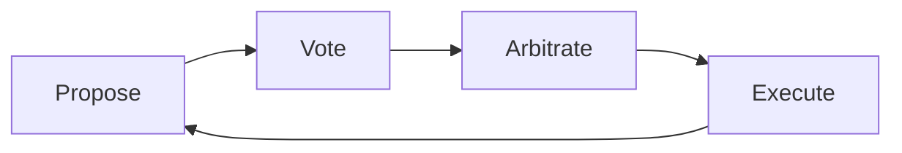

# Introduction to DIAL

**DIAL** (Dynamic Integration between AI and Labor) is a coordination framework for AI and human specialists making decisions together within state machines.

## Why DIAL?

The promise of AI is efficiency: faster, cheaper execution of narrow tasks. But the question organizations face isn't "Can AI do this?" It's:

> **How do you know, in dollars, time, and quality, exactly what it would cost to turn any task over to a minimally competent AI decision-maker? And how involved should humans remain as quality control?**

DIAL provides the answer through **empirical measurement**, not speculation.

## The Core Insight

An AI model operates on a bounded context window. A human operates on a **lifetime of embodied experience**, tacit knowledge, institutional context, and real-time sensory input that no model has access to. The human knows things they cannot tell the machine.

## Three Foundational Principles

### 1. Human Primacy

The human is always right, not because humans are infallible, but because humans have context that AI cannot access.

An AI specialist is judged on alignment with human choices. The standard is distributional: output should match the distribution a population of competent humans would produce for the same decision.

### 2. Progressive Collapse

Over repeated decision cycles, measuring how well AI predicts human choices causes the multi-agent deliberation structure to **progressively collapse into deterministic execution**.

This collapse is emergent, not designed. As AI specialists prove their alignment with human judgment through accumulated data, the expensive deliberation process naturally simplifies.

### 3. Empirical Trust

Trust is earned through demonstrated alignment with human decisions and through continued sampling of human preferences. Specialists prove their value one decision at a time.

## What DIAL Is Not

DIAL is not about AI replacing humans. It targets decisions that humans already make well and measures whether AI specialists can replicate those decisions cheaply enough to justify delegation, with precise cost data on ongoing human quality-control. The value of AI is not superiority. **It is efficiency.** AI is faster and cheaper at narrow tasks where the required context fits within the model's window.

## How It Works

1. **Model the task as a state machine**: Define states, transitions, and decision prompts
2. **Register proposers, voters, and arbiters**: AI and human specialists that propose transitions, vote on them, and define consensus logic
3. **Run decision cycles**: Propose, Vote, Arbitrate, Execute
4. **Reach the goal state**: The session completes when it reaches its `defaultState`

## What's Next?

  

    

      

        <h3>🚀 Get Started</h3>
      

      

        
Install DIAL and run your first state machine with AI and human specialists.

        <a href="/docs/getting-started/installation" className="button button--primary">Installation Guide →</a>
      

    

  

  

    

      

        <h3>📚 Learn Concepts</h3>
      

      

        
Understand sessions, specialists, decision cycles, and arbitration strategies.

        <a href="/docs/concepts/intro" className="button button--secondary">Explore Concepts →</a>
      

    

  

## Key Terminology

| Term | Definition |
|------|------------|
| **Session** | An instance of a state machine being navigated by specialists |
| **Specialist** | A pluggable actor (AI or human) that proposes transitions or votes |
| **Decision Cycle** | The repeating process: Propose, Vote, Arbitrate, Execute |
| **Arbiter** | The built-in logic that evaluates consensus and determines when a proposal wins |
| **Default State** | The goal state; the session is complete when it reaches this state |
